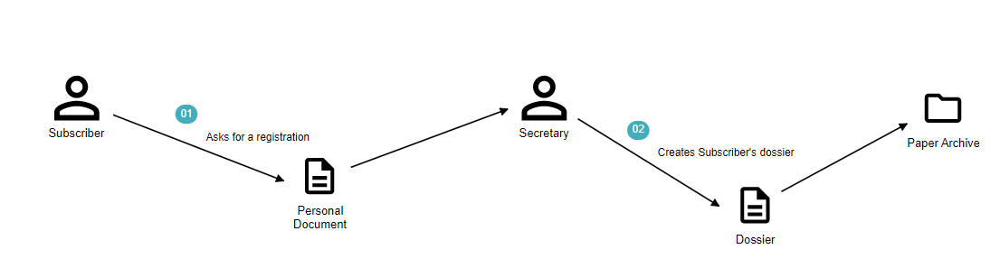
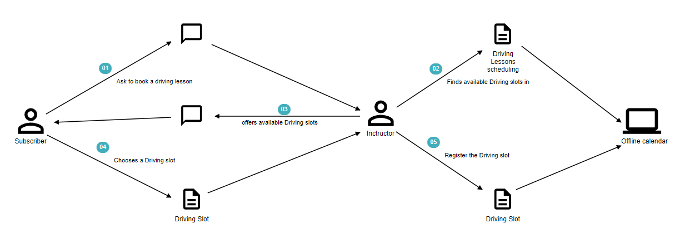
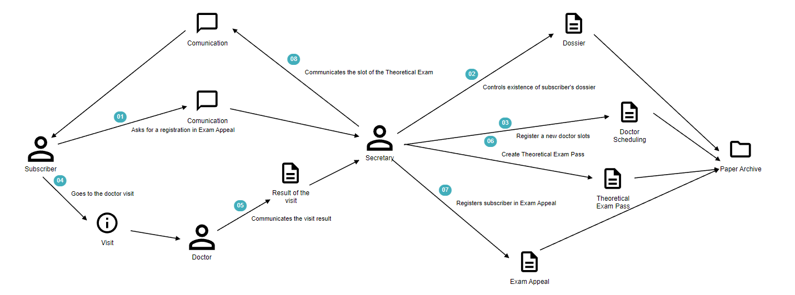
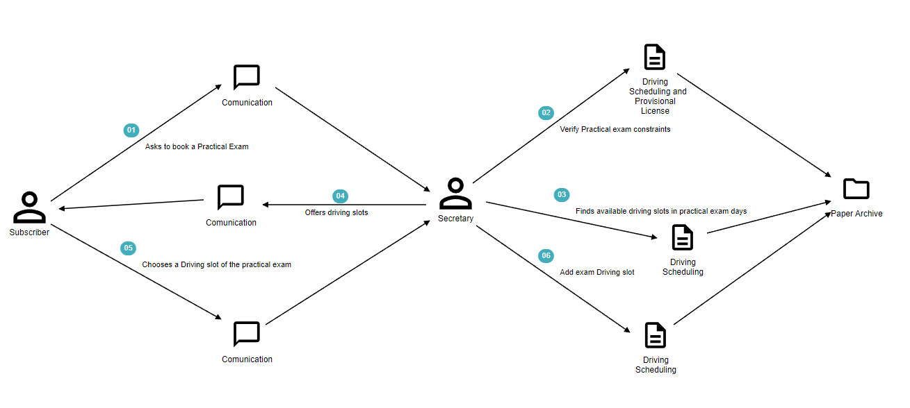

# Knowledge crunching

Dopo aver analizzato la richiesta che è stata effettuata e prodotto l’impact map si è tenuto la prima intervista con il committente, riportata di seguito.

**Analista**: Nella sua richiesta, ci ha chiesto di sviluppare un backend da porre come base per digitalizzare i vostri processi aziendali, corretto ?

**Cliente**: Si, il front-end viene attualmente sviluppato da un team differente perciò abbiamo bisogno solo di back-end.

**Analista**: Al momento attuale, i documenti come vengono gestiti ?

**Cliente**: Alla situazione attuale, disponiamo di un archivio cartaceo, contenente il fascicolo relativo a ciascun iscritto. Per la gestione delle guide, degli esami pratici e teorici e delle visite necessarie, ci avvaliamo di un calendario offline.

**Analista**: Nell'archivio cartaceo, quali tipi di documenti vengono mantenuti per ogni studente ?

**Cliente**: Innanzitutto, identifichiamo gli utenti dell'autoscuola come Iscritti e non come studenti. Per ciascun iscritto manteniamo una pratica e un fascicolo.

**Analista**: Cosa intendi con fascicolo ?

**Cliente**: Il fascicolo include la pratica e altri documenti a essa collegati, ad esempio il foglio rosa o il registro dell'esame teorico.

**Analista**: E la pratica invece che cosa contiene ?

**Cliente**: La pratica include alcune informazioni di base relative all'iscritto, ad esempio Nome, Cognome, stato attuale di esami pratici e teorici.

**Analista**: Parlando invece del calendario offline che attualmente utilizzate, mi pare di capire che sia un software, senza però collegamento in rete. Che informazioni vi vengono salvate ?

**Cliente**: Sul calendario, inseriamo la programmazione delle guide di ciascun iscritto, i giorni d'esame e la coda delle visite da effettuare con il dottore.

**Analista**: Perciò quali processi sei interessato a digitalizzare ?

**Cliente**: Principalmente, vorrei digitalizzare e velocizzare le operazioni relative a:
- gestione delle guide
- gestione degli esami pratici, in termini d'iscrizioni, gestione dei tentativi
- gestione degli esami teorici, mantenendo se possibile un registro dell'esame teorico per ciascun iscritto
- gestione dei veicoli e degli istruttori, con i quali ciascuna guida è effettuata
- gestione maggiormente digitalizzata di pratiche e fascicoli, in modo da avere meno errori di consistenza e duplicazioni dei dati, a oggi purtroppo presenti

## Domain story telling
Per approfondire maggiormente la conoscenza del dominio, dei processi aziendali e di eventuali problemi riscontrati alla situazione attuale all'interno della azienda, si sono effettuati ulteriori colloqui con il cliente e gli esperti del dominio, maggiormente focalizzati sui processi precedentemente indicati.

Come strumento per la gestione e la rappresentazione grafica dei colloqui, si è deciso di utilizzare la strategia del Domain Storytelling, la quale prevede di lasciare raccontare agli esperti del dominio, come vengono svolte le differenti operazioni all'interno della Scuola Guida e cosa si vorrebbe ottenere come risultato, mentre i developers si occupano di catturare il racconto effettuato dall'esperto del dominio, tramite l'utilizzo del seguente linguaggio pittografico.

Per favorire le successive fasi di razionalizzazione e progettazione, i termini inseriti corrispondono all'[Ubiquitous Language](UbiquitousLanguage.md) discusso con gli esperti del dominio.

I risultati emersi da tali analisi, sono mostrati di seguito.

**User Story: registrazione di un nuovo iscritto**

**Analista**: Allo stato attuale, come viene gestita la registrazione di un nuovo iscritto ?

**Esperto del dominio**: Quando un utente entra e richiede l'iscrizione per una determinata patente, gli vengono richieste alcune informazioni di base e la copia di un documento identificativo, da registrare nella relativa pratica, successivamente inserita nell'archivio cartaceo.

      
      
[Fig 1] Domain story telling: gestione attuale per la registrazione di un nuovo iscritto

**User Story: inserimento di una guida**

**Analista**: Attualmente, una nuova guida come viene registrata ? Chi la può registrare ?

**Esperto del dominio**: Quando un iscritto richiede una successiva guida all'istruttore, quest'ultimo controlla la programmazione delle guide e comunica all'iscritto le possibili date. Lui potrà quindi confermare una data tra quelle proposte e sarà l'istruttore che provvederà alla registrazione manuale di un nuovo slot di guida, presso l'ufficio.

**Analista**: A parte giorno e orario, quali altre informazioni vengono associate a uno slot di guida ?

**Esperto del dominio**: Ciascuna guida, è univocamente collegata a un singolo Iscritto, un Istruttore e un Veicolo (oltre alle informazioni da voi elencate).

      
      
[Fig 2] Domain story telling: registrazione di uno slot di guida

**User Story: gestione attuale degli esami teorici**

**Analista**: Mi descrivi lo scenario principale e più tipico per la registrazione di un iscritto all'appello di un esame teorico ?

**Esperto del dominio**: Il caso tipico, è quello in cui l'iscritto non è ancora idoneo all'esame, cioè la visita medica non è ancora stata effettuata, perciò bisogna innanzitutto scegliere la data e l'orario della visita.

**Analista**: Come vengono definite le date delle visite ?

**Esperto del dominio**: Il personale medico per ciascuna scuola guida, mette a disposizione alcune giornate e fascie orarie standard e predefinite. Per la mia esperienza di lavoro nel settore, queste informazioni non vengono mai modificate.

**Analista**: Ok. Dopo aver fissato la visita medica, come si procede ?

**Esperto del dominio**: Il personale medico, successivamente alla visita, ne comunica il risultato. A questo punto viene assegnato alla pratica dell'iscritto un registro, per la gestione dei tentativi d'esame. L'iscritto viene quindi registrato al prossimo appello d'esame disponibile.

      
      
[Fig 3] Domain story telling: gestione di un esame teorico

**User Story: gestione attuale degli esami pratici**

**Analista**: Quando un iscritto manifesta l'intenzione di effettuare un esame pratico, come si procede ?

**Esperto del dominio**: Come prima cosa verifichiamo due fattori principali:
- la programmazione passata delle guide per verificarne il numero esatto (almeno 12)
- il possedimento di un foglio rosa valido

Verificati questi fattori, si ricerca il primo slot di guida disponibile per effettuare l'esame pratico, e lo si propone all'iscritto.

**Analista**: In precedenza hai parlato di slot di guida in riferimento a guide pratiche "standard". Qual è la differenza tra i due ?

**Esperto del dominio**: La principale differenza riguarda il fatto che gli slot relativi a esami pratici devono essere etichettati come tali e possono essere inseriti solo in determinati giorni da noi impostati. In tali giornate si hanno a disposizione uno o più esaminatori, che conducano gli esami.

**Analista**: Se l'iscritto accetta le date a lui precedentemente proposte, come si procede ?

**Esperto del dominio**: Viene inserito nella programmazione un nuovo slot di guida, relativo all'esame in questione.

      
      
[Fig 4] Domain story telling: gestione di un esame pratico

