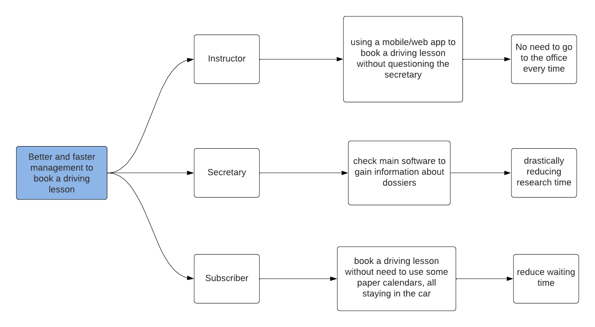
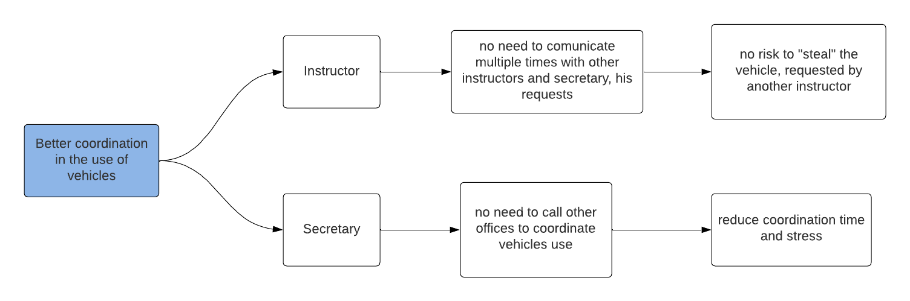
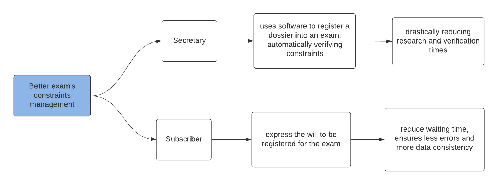

# Richiesta committente

"Sono il proprietario di due scuola guida. Dato l'avanzare dei tempi, richiedo un software di back-end che possa gestire i bisogni del settore nel quale opero.
In particolare, ho gia proceduto a richiedere la realizzazione del front-end.

Vi sono alcune complessità che il dominio di mia competenza, porta con se, riguardanti la gestione delle guide, degli esami e di tutto ciò che concerne gli iscritti, che frequentano le scuola guida.
Lo scopo sarebbe quello di ottenere un software che possa consentire l'utilizzo distribuito nello spazio di determinate funzioni, un esempio fra tutti: uno dei requisiti sarebbe la prenotazione delle guide mediante ambiente esterno agli uffici.

Allo stato attuale, ogni processo è svolto in modo cartaceo o ultimamente con l'utilizzo di applicativi offline, che non ne consentono l'utilizzo efficace ed efficiente, anche in mobilità.
L'utilizzo di applicativi non unici e offline porta con se ulteriori limitazioni, riguardanti la correttezza e la consistenza dei dati tra i diversi uffici."

## Impact Map

Successivamente alla richiesta precedentemente illustrata, il team di sviluppo ha deciso di produrre le seguenti impact map, per riuscire a comprendere maggiormente il problema e formulare domande significative nelle successive interviste.

Nelle impact map fornite, il primo livello indica l'obiettivo che vogliamo ottenere con la messa in atto del progetto concluso.
Ad esempio: miglior gestione (in termini di velocità e minor inconsistenza dei dati) per le guide.

Il secondo livello mostra gli attori coinvolti per il raggiungimento degli obiettivi preposti. Questi possono essere categorizzati in: utenti che interagiscono direttamente sul sistema (Istruttore o Segretario) e Iscritti (attori esterni che interagiscono con utenti del sistema).

Il livello successivo descrive l'impatto del progetto sulle azioni che gli attori andranno a effettuare.
L'ultimo livello individua il *business value* atteso dal raggiungimento degli obiettivi inizialmente individuati.

      
      
[Fig 1] Impact map: gestione delle guide

      
      
[Fig 1] Impact map: utilizzo e coordinamento nell'utilizzo dei veicoli

      
      
[Fig 1] Impact map: gestione degli esami e relativi vincoli

