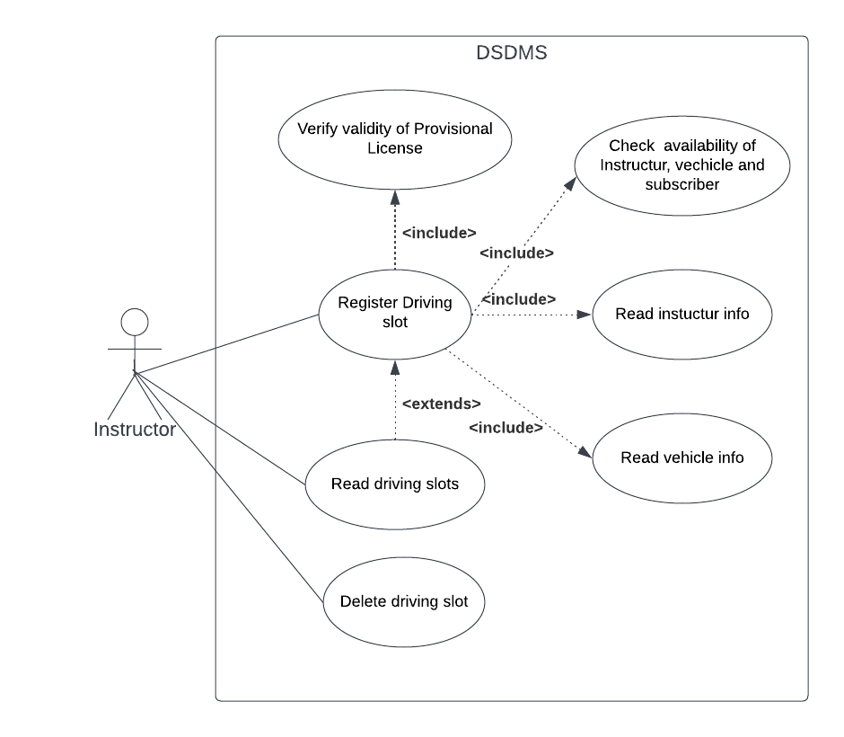
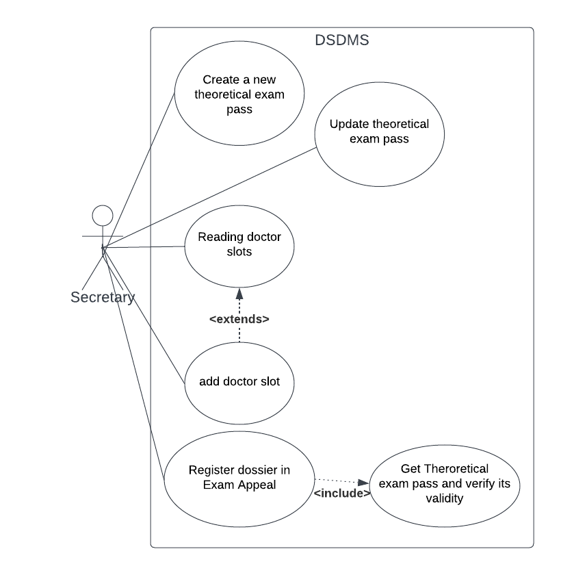
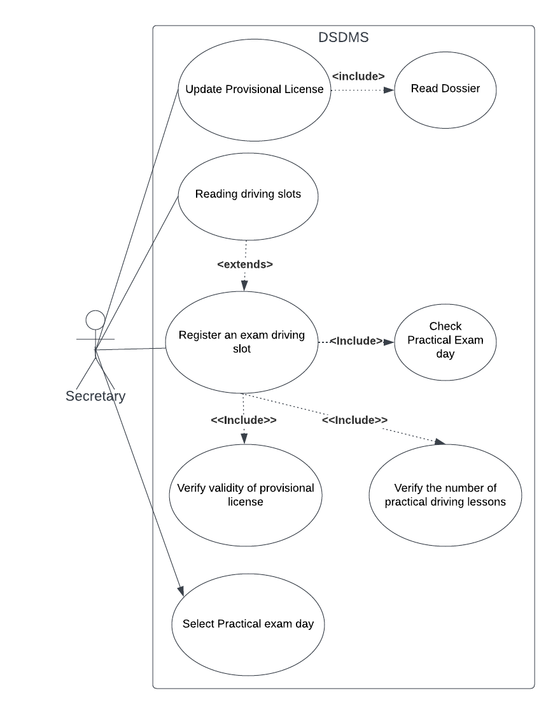

# Casi d'uso

A partire da ciò che emerso dalle precedenti fasi di analisi del dominio, sono stati dedotti quattro casi d'uso principali, in base alle necessità richieste dal cliente e dagli esperti del dominio.

Per favorire le successive fasi di razionalizzazione e progettazione, i termini inseriti corrispondo all'[Ubiquitous Language](UbiquitousLanguage.md) discusso precedentemente.

      
      
[Fig 1] Diagramma dei casi d'uso: gestione del Dossier

Il diagramma visualizzato in <a href="#fig1"> Figura 1 </a>, mostra il caso d'uso relativo alla gestione del Dossier. Un Dossier contiene tutte le informazioni di base (ad esempio nominativo, codice fiscale, numero ti fogli rosa) di un Iscritto.
L'attore che svolge le operazioni è identificato come Segretario: tutte le operazioni visibili sono infatti svolte dopo esplicite richieste degli iscritti.

In particolare la procedura di **Update Exam Status of Dossir** specifica aggiornamento sul completamento di esami pratici/teorici. In caso invalidazione di due fogli rossa dossier deve essere invalidato

      
      
[Fig 2] Diagramma dei casi d'uso: gestione delle guide

Il secondo diagramma mostrato in <a href="#fig2"> Figura 2 </a>, invece, mostra l'ipotetica gestione delle guide.
Ciascuna guida è univocamente collegata a un Iscritto, un Istruttore, un Veicolo e una fascia oraria.
L'attore in questione è l'Istruttore: con l'utilizzo del software messo a disposizione, l'obiettivo è infatti quello di velocizzare le operazioni d'inserimento degli slot di guida, evitando processi maggiormente prolungati e costosi.
Come evidenziato dal diagramma l'inserimento di uno slot, comporta alcuni *include* (determinate operazioni richieste per l'esistenza del caso d'uso principale):
- verificare la validità del foglio rosa
- verificare la disponibilità d'Istruttore, Veicolo e Dossier
- ricercare un giorno e fascia oraria che soddisfi i vincoli imposti dal concetto di slot

      
      
[Fig 3] Diagramma dei casi d'uso: gestione degli esami teorici 

Il diagramma visibile in <a href="#fig3"> Figura 3 </a> evidenzia la gestione degli esami teorici: anche in questo caso l'attore presente è il Segretario, che esegue le operazioni visibili:
- legge gli slot disponibili per la visita, inserendo l'iscritto nel primo slot libero
- completata la visita e avendo quindi a disposizione un registro per l'esame teorico, l'iscritto sarà registrato in un appello d'esame
  
Anche in questo caso, la registrazione all'appello d'esame necessita di un controllo sulla validità del registro d'esame dell'iscritto (come evidenziato dall'*include*)

      
      
[Fig 4] Diagramma dei casi d'uso: gestione degli esami pratici

L'ultimo diagramma presente, <a href="#fig4"> Figura 4 </a>, mette in risalto la gestione degli esami pratici, da parte del Segretario:
- registra un nuovo foglio rossa
- registra uno slot di guida, relativo a un esame pratico. L'*include* evidenzia alcune operazioni necessarie per l'esistenza di questo caso d'uso: verifica sul giorno d'esame, sulla validità del foglio rosa e sul minimo numero di guide effettuate necessarie
- aggiorna il numero di tentativi dell'esame pratico referiti al foglio rosa dell'iscritto
- seleziona il giorno d'esame tra quelli disponibili