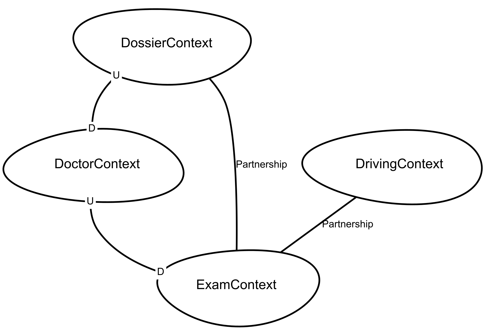

# Strategical Design

Per evolvere il dominio a questo punto si è pensato di procedere tramite Strategic Design. Questo tipo di studio individua, a partire dai casi d’uso, i diversi sotto-domini che compongono il dominio principale.

Abbiamo quindi individuato, quattro sotto domini all'interno del dominio in esame:
- Dossier: sotto dominio che mantiene le informazioni di base degli utenti e le procedure per la relativa gestione
- Exam: sotto dominio per la gestione degli esami pratici e teorici e tutto ciò che ne concerne (es. registro d'esame teorico e foglio rosa)
- Driving: sotto dominio per la gestione delle guide pratiche effettuate da ciascun iscritto

I sotto domini sopra elencati, sono stati inoltre classificati come:
- Generic domain: rappresenta alcune funzioni comuni a più sotto domini
- Core domain: rappresenta una o più funzioni primarie, all'interno del dominio principale
- Supporting domain: raggruppa determinate funzioni necessarie ma non fondamentali per il dominio principale

Avendo chiaro le informazioni di cui sopra, i sotto domini precedentemente individuati sono stati classificati come segue: Dossier di tipo Genreric, Exam di tipo Core e Driving di tipo Support.

### Bounded contex

Per tre sotto domini rilevati sono stati progettaiti quatro bounded context:
- *Dossier context* che appartieniene a Dossier subdomain
- *Driving context* che appartiene a Driving subdomain
- *Exam context* e *Doctor context* che appartengono a Exam subdomain 

      
      
[Fig 1] Context map del sistema

## Bounded context canvas

Il successivo passaggio di progettazione, dettato dal DDD, è stata la progettazione dei Bounded Contexts all'interno dei domini in esame.
Ciascun Bounded Context modella una porzione del dominio, definendone i confini in modo chiaro e non ambiguo, con l'obiettivo di gestirne le relative entrate ed uscite in termini di informazioni ed azioni eseguibili.

Per ciascun contesto individuato, di seguito si propone una rappresentazine testuale dei Bounded Context Canvas.

### Dossier context

**Description**: Gestione di tutte le informazione riguardanti un iscritto, gestisce invalidità delle pratiche

**Strategic classification**: 
- Domain: Generic
- Business Model: compliance enforcer
- Evolution: commodity

**Business Decisions**: 
- Dopo la scadenza del primo foglio rosa, il numero di tentativi d'esame possibili, deve essere azzerato
- La pratica deve poter essere annullata dopo la scadenza del secondo foglio rosa
- Una pratica invalida, non può essere modificata ma solo visualizzata a fini di storicizzazione
- Non può essere registrato un iscritto con meno di 16 anni
- Invalidazione manuale della pratica (opzionale)
  
**Inbound Communications**:
- Register a new dossier (Client → a command)
- Update Practical Exam Status (Client → a command)
- Aggiornamento di Exam Attempts per ciascuna pratica ( Exam context -> an event )
- Notification that Provisional license is not valid anymore ( Exam context → an event)
- Notification that Theoretical or Practical exam has been  ( Exam context → an event)
- Read Dossier (Client, Exam context → a query)

### Driving context
**Description**: Consente la gestione degli slot di guida, acquisendo l’informazione relative a veicoli, istruttori e utilizzando l’informazione del foglio rosa relativo ad una pratica.

**Strategic classification**:
- Domain: Core
- Business Model: revenue generator
- Evolution: commodity

**Business Decisions**:
- In un certo giorno e orario, uno slot di guida è univocamente collegato a:
    - Un istruttore
    - Un Id relativo ad una pratica
    - Un veicolo
- La durata di ciascun slot di guida è 30 minuti, iniziando ad intervalli regolari di tempo
- Un iscritto può prenotare uno slot di guida alla volta. Dopo il completamento, può prenotarne uno nuovo.
- All’inserimento di uno slot di guida, verificare la validità del provisional license
- Un veicolo dopo X slot di guida deve effettuare un controllo (opzionale)

**Inbound Communications**:
- Register a new Practical Driving lesson or exam (Client → a command)
- Delete Practical Driving Lessons (Client → a command)
- Read Practical Driving slots (Exam context, Client → a query)
    
**Outbound Communications**:
- Check provisional license validity (Exam context → A query)

### Exam context
**Description**: Consente la gestione di esame teorico e pratico, insieme a tutto ciò che ne concerne (registro d'esame teorico e foglio rosa).

**Strategic classification**: 
- Domain: Support
- Business Model: compliance enforcer
- Evolution: custom built

**Business Decisions**: 
- Ciascun foglio rosa deve essere associato univocamente ad una pratica e viceversa
- Se una pratica è invalida, non deve essere possibile utilizzarla relativamente alla gestione degli esami
- Esame teorico:
    - Necessario un registro d'esame teorico valido, con le seguenti caratteristiche:
        - consente 2 tentativi d'esame entro 6 mesi
        - viene fornito dopo la visita medica
        - Dopo la scadenza, necessaria una nuova visita medica (Pratica rimane valida)
- Esame pratico:
    - Necessario un foglio rosa valido, con le seguenti caratteristiche:
        - consente 3 tentativi d'esame entro 12 mesi
        - viene fornito dopo il superamento dell'esame teorico insieme alla notifica a Dossier Context
        - Dopo la prima scadenza, è necessario riconseguire l'esame teorico e notificare Dossier Context
        - Dopo la seconda scadenza, Dossier context viene notificato

**Inbound Communications**:
- Regiser theoretical exam appeal day (Client → A command)
- Read list of future theoretical exam appeals (Client -> A query)
- Read theoretical exam appeal information (Clent -> A query)
- Register a dossier in Exam Appeal (Client → A command)
- Creation of a Theoretical Exam pass (Doctor context → A command)
- Create Provisional License (Client -> a command)
- Read Provisional License info (Client -> a query)
- Check validity of Provisional License (Driving context → A query)

**Outbound Communications**:
- Notify the Provisional license is not valid anymore (Dossier context → an event)
- Get Practical Driving slots for a Dossier to count them (Driving context → a query)

### Doctor context

**Description**: consente la gestione di tutto ciò che concerne la visita, necessaria agli iscritti per poter coneguire l'esame teorico.

**Strategic classification**: 
- Domain: Support
- Business Model: compliance enforcer
- Evolution: custom built
  
**Business Decisions**: 
- Se una pratica è invalida, non deve essere possibile utilizzarla per la prenotazione delle visite
- Il giorno in cui le visite sono effettuabili è stabilito da entità esterne al sistema e non può essere modificato (ogni Giovedì dalle 18 alle 19:30)
- Ciascuna visita ha una durata di 15 minuti (max 6 iscritti)

**Inbound Communications**:
- Read Doctor slots (Client → A Query)
- Add Doctor slots (Client → A command)
- Register visit result for a dossier id (Client -> A command)
  
**Outbound Communications**:
- Comunicate that visit has been done (Exam context -> A command)
- Read dossier to verify validity (Dossier context -> A query)
