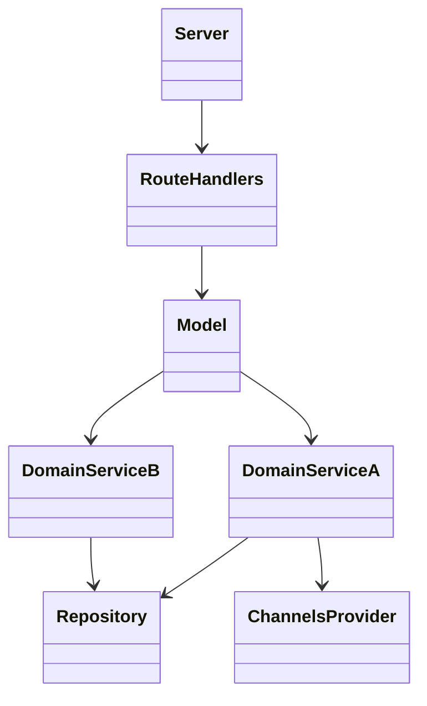
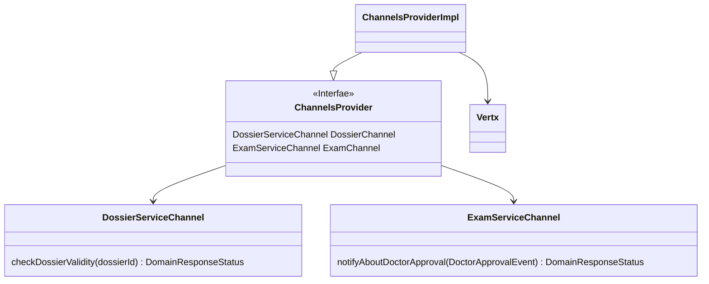
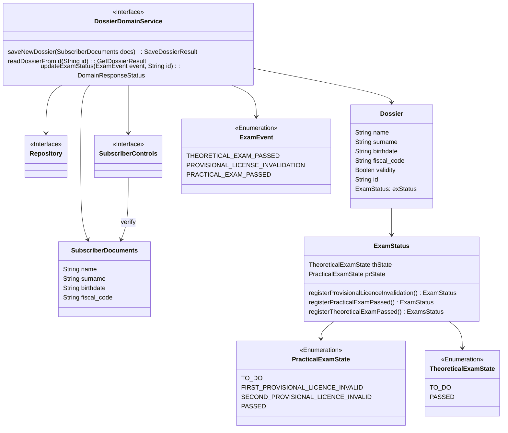
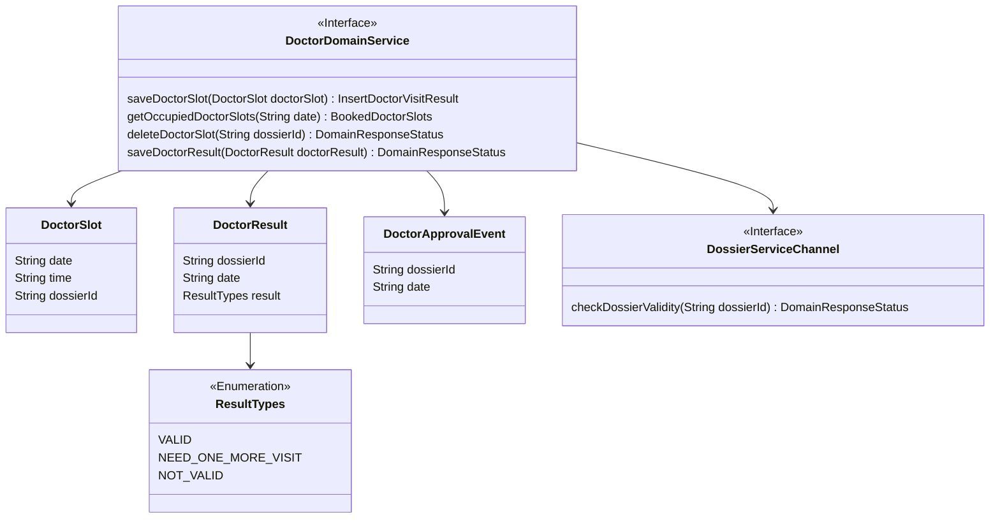

```mermaid
classDiagram
Server --> RouteHandlers
RouteHandlers --> Model
Model --> DomainServiceA
Model --> DomainServiceB
DomainServiceA --> Repository
DomainServiceA --> ChannelsProvider
DomainServiceB --> Repository

```

## ChannelsProvider

```mermaid
classDiagram

class ChannelsProvider{
    <<Interfae>>
    DossierServiceChannel DossierChannel
    ExamServiceChannel ExamChannel

}

ChannelsProviderImpl --|> ChannelsProvider
ChannelsProviderImpl --> Vertx

class DossierServiceChannel{
    checkDossierValidity(dossierId) DomainResponseStatus
}

class ExamServiceChannel{
    notifyAboutDoctorApproval(DoctorApprovalEvent) DomainResponseStatus
}
ChannelsProvider --> DossierServiceChannel
ChannelsProvider --> ExamServiceChannel

```

## Dossier Service

```mermaid
classDiagram


class DossierDomainService {
    <<Interface>>
    saveNewDossier(SubscriberDocuments docs): SaveDossierResult
    readDossierFromId(String id): GetDossierResult
    updateExamStatus(ExamEvent event, String id): DomainResponseStatus
}

class Repository 
<<Interface>> Repository 

class SubscriberControls 
<<Interface>> SubscriberControls 

DossierDomainService --> Repository
DossierDomainService --> Dossier
DossierDomainService --> ExamEvent
DossierDomainService --> SubscriberDocuments
DossierDomainService --> SubscriberControls 

SubscriberControls --> SubscriberDocuments : verify

class SubscriberDocuments{
    String name
    String surname
    String birthdate
    String fiscal_code

}

class Dossier{
    String name
    String surname
    String birthdate
    String fiscal_code
    Boolen validity
    String id
    ExamStatus: exStatus
}
class ExamEvent{
    <<Enumeration>>
    THEORETICAL_EXAM_PASSED
    PROVISIONAL_LICENSE_INVALIDATION
    PRACTICAL_EXAM_PASSED
}


Dossier --> ExamStatus
class ExamStatus{
    TheoreticalExamState  thState
    PracticalExamState  prState
    registerProvisionalLicenceInvalidation() ExamStatus
    registerPracticalExamPassed() ExamStatus
    registerTheoreticalExamPassed() ExamsStatus
}

ExamStatus --> PracticalExamState
ExamStatus --> TheoreticalExamState


class PracticalExamState {
    <<Enumeration>>
    TO_DO
    FIRST_PROVISIONAL_LICENCE_INVALID
    SECOND_PROVISIONAL_LICENCE_INVALID
    PASSED
}


class TheoreticalExamState {
    <<Enumeration>>
    TO_DO
    PASSED
}

```

## Doctor Service

```mermaid
classDiagram

class DoctorDomainService{
    <<Interface>>
    saveDoctorSlot(DoctorSlot doctorSlot) InsertDoctorVisitResult
    getOccupiedDoctorSlots(String date) BookedDoctorSlots
    deleteDoctorSlot(String dossierId) DomainResponseStatus
    saveDoctorResult(DoctorResult doctorResult) DomainResponseStatus

}

DoctorDomainService --> DoctorSlot
DoctorDomainService --> DoctorResult
DoctorDomainService --> DoctorApprovalEvent
DoctorDomainService --> DossierServiceChannel

class DoctorSlot {
    String date
    String time
    String dossierId
}

class DoctorResult {
    String dossierId
    String date
    ResultTypes result
}

DoctorResult --> ResultTypes

class ResultTypes {
    <<Enumeration>>
    VALID
    NEED_ONE_MORE_VISIT
    NOT_VALID
}

class DoctorApprovalEvent {
    String dossierId
    String date
}

class DossierServiceChannel {
    <<Interface>>
    checkDossierValidity(String dossierId) DomainResponseStatus
}


```