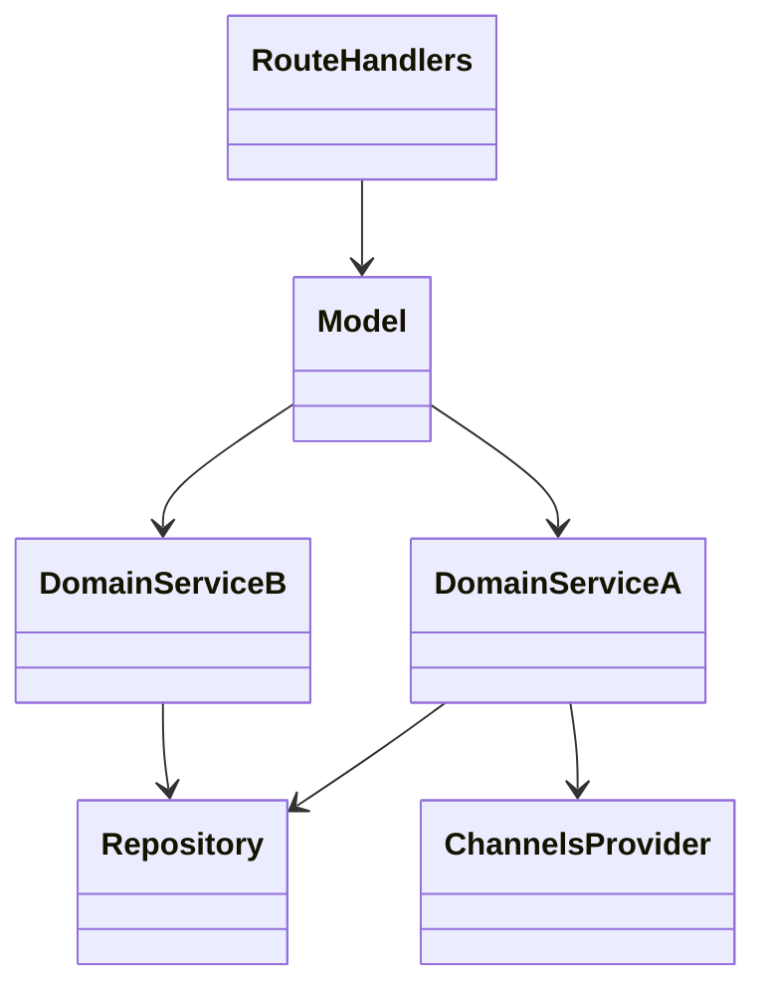
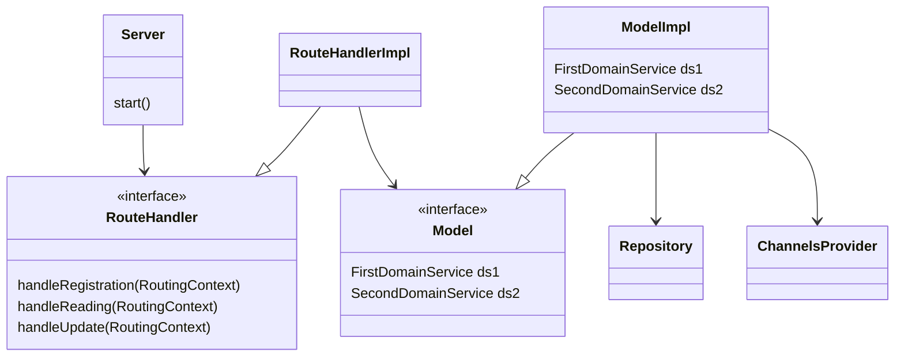
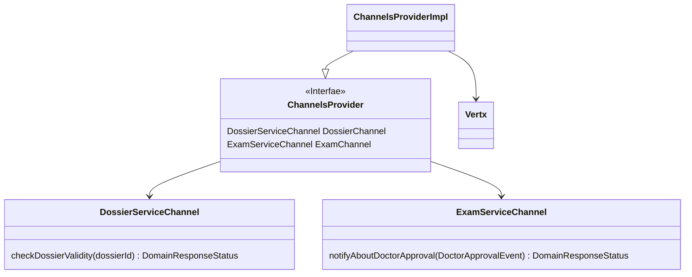

```mermaid
classDiagram

RouteHandlers --> Model
Model --> DomainServiceA
Model --> DomainServiceB
DomainServiceA --> Repository
DomainServiceA --> ChannelsProvider
DomainServiceB --> Repository


```
## Yes

```mermaid
classDiagram
class Server{
    start()
}
class RouteHandler{
    <<interface>>
    handleRegistration(RoutingContext)
    handleReading(RoutingContext)
    handleUpdate(RoutingContext)
}
Server --> RouteHandler

RouteHandlerImpl --> Model
class Model{
    <<interface>>
    FirstDomainService ds1
    SecondDomainService ds2
}

class ModelImpl{
    FirstDomainService ds1
    SecondDomainService ds2
}

RouteHandlerImpl --|> RouteHandler
ModelImpl --|> Model
ModelImpl --> Repository
ModelImpl --> ChannelsProvider


```
# Boom

```mermaid
classDiagram

class ChannelsProvider{
    <<Interfae>>
    DossierServiceChannel DossierChannel
    ExamServiceChannel ExamChannel

}

ChannelsProviderImpl --|> ChannelsProvider
ChannelsProviderImpl --> Vertx

class DossierServiceChannel{
    checkDossierValidity(dossierId) DomainResponseStatus
}

class ExamServiceChannel{
    notifyAboutDoctorApproval(DoctorApprovalEvent) DomainResponseStatus
}
ChannelsProvider --> DossierServiceChannel
ChannelsProvider --> ExamServiceChannel

```

# Bam

