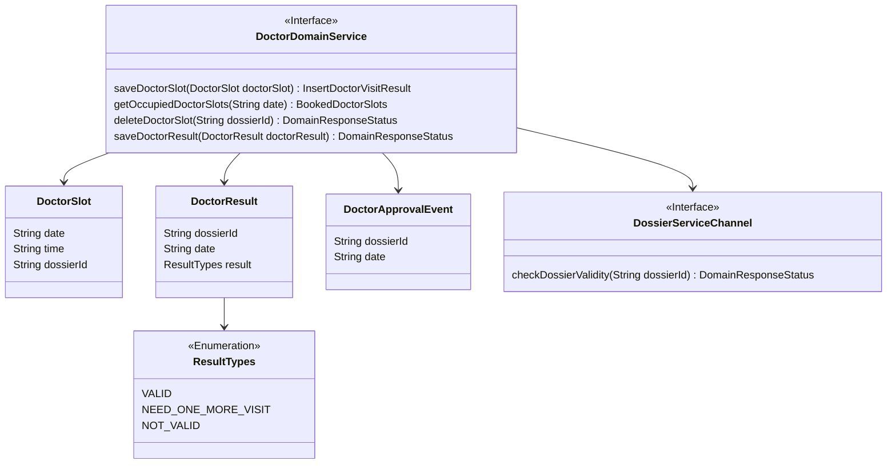

# Doctor Service

- **Entities**: DoctorSlot
- **Value objects**: DoctorResutl
- **Events**: DoctorApprovalEvent

```mermaid
classDiagram

class DoctorDomainService{
    <<Interface>>
    saveDoctorSlot(DoctorSlot doctorSlot) InsertDoctorVisitResult
    getOccupiedDoctorSlots(String date) BookedDoctorSlots
    deleteDoctorSlot(String dossierId) DomainResponseStatus
    saveDoctorResult(DoctorResult doctorResult) DomainResponseStatus

}

DoctorDomainService --> DoctorSlot
DoctorDomainService --> DoctorResult
DoctorDomainService --> DoctorApprovalEvent
DoctorDomainService --> DossierServiceChannel

class DoctorSlot {
    String date
    String time
    String dossierId
}

class DoctorResult {
    String dossierId
    String date
    ResultTypes result
}

DoctorResult --> ResultTypes

class ResultTypes {
    <<Enumeration>>
    VALID
    NEED_ONE_MORE_VISIT
    NOT_VALID
}

class DoctorApprovalEvent {
    String dossierId
    String date
}

class DossierServiceChannel {
    <<Interface>>
    checkDossierValidity(String dossierId) DomainResponseStatus
}


```