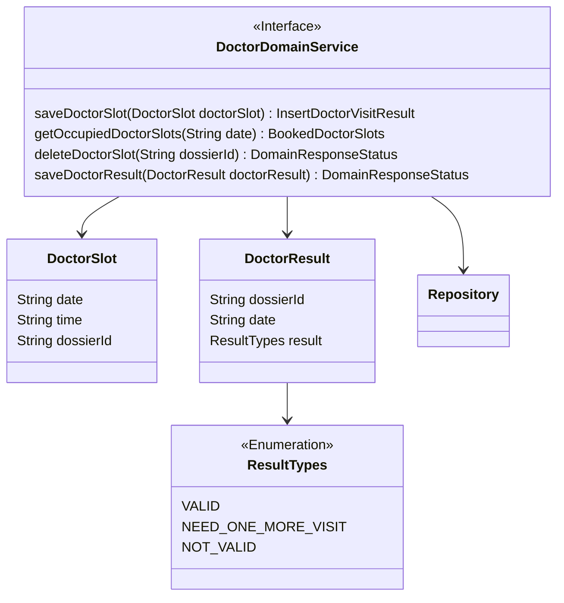
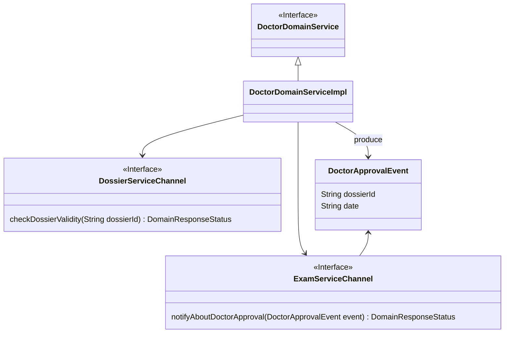
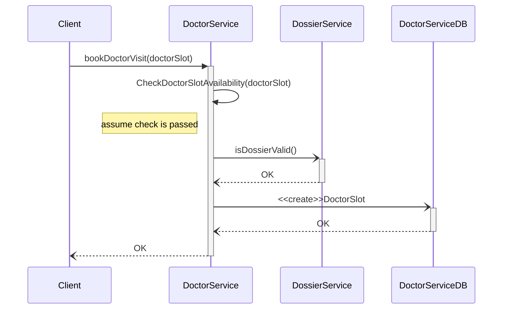
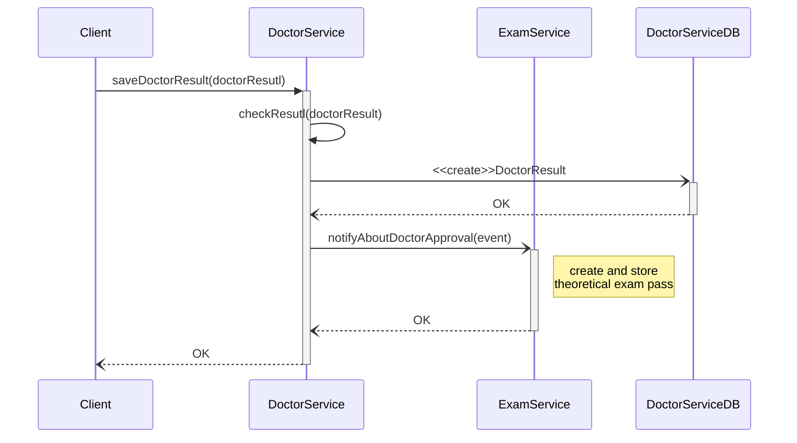

# DoctorService tactical design

- **Entities**: DoctorSlot
- **Value objects**: DoctorResutl
- **Events**: DoctorApprovalEvent
  
<a href="#domain">figura</a>
<a href="#l0">figura2</a>

## Doctor domain service


<div id="domain" align="center">
 ```mermaid
    classDiagram
    class A
    class B
    A --> B
 ```
</div>


<p align="center">[Fig 1] Diagramma della struttura del Doctor bounded contex</p>

## Doctor bounded context communicaiton


<div id="l1"></div>



<p align="center">[Fig 2] Diagramma che mostra come Doctor bounded context comunica con DossierContext e </p>


## Sequence diagramm



<div align="center">[Fig 3] Diagramma di sequenza che mostra un scenario di successo della prenotazione di una visita dal dotore</div>


### Registrazione dei risultati 


<div align="center">[Fig 4] Diagramma di sequenza dove dopo registrazione di un risultato positivo della visita dal dottore viene avviata la creazione di registro esame teorico </div>