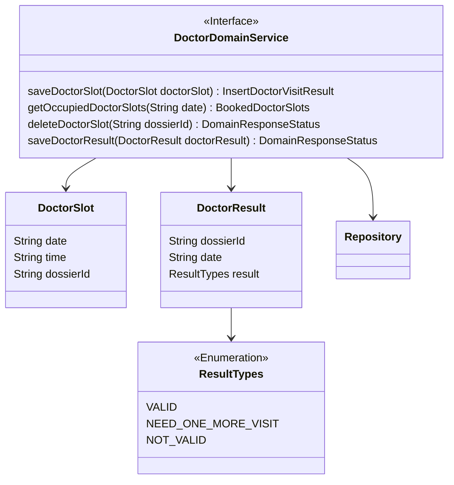
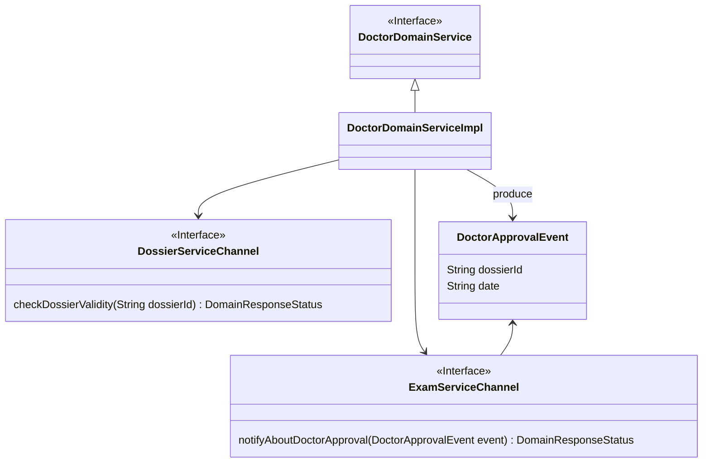

# DoctorService tactical design

- **Entities**: DoctorSlot
- **Value objects**: DoctorResutl
- **Events**: DoctorApprovalEvent

## Doctor domain service

```mermaid
classDiagram

class DoctorDomainService{
    <<Interface>>
    saveDoctorSlot(DoctorSlot doctorSlot) InsertDoctorVisitResult
    getOccupiedDoctorSlots(String date) BookedDoctorSlots
    deleteDoctorSlot(String dossierId) DomainResponseStatus
    saveDoctorResult(DoctorResult doctorResult) DomainResponseStatus

}

DoctorDomainService --> DoctorSlot
DoctorDomainService --> DoctorResult
DoctorDomainService --> Repository


class DoctorSlot {
    String date
    String time
    String dossierId
}

class DoctorResult {
    String dossierId
    String date
    ResultTypes result
}


DoctorResult --> ResultTypes

class ResultTypes {
    <<Enumeration>>
    VALID
    NEED_ONE_MORE_VISIT
    NOT_VALID
}


```

## Doctor bounded context communicaiton

```mermaid
classDiagram
direction TB
class DoctorDomainService{
    <<Interface>>
}

DoctorDomainService <|-- DoctorDomainServiceImpl
DoctorDomainServiceImpl --> DossierServiceChannel
DoctorDomainServiceImpl --> ExamServiceChannel 


class DossierServiceChannel {
    <<Interface>>
    checkDossierValidity(String dossierId) DomainResponseStatus
}

class ExamServiceChannel {
    <<Interface>>
    notifyAboutDoctorApproval(DoctorApprovalEvent event) DomainResponseStatus
}


DoctorDomainServiceImpl --> DoctorApprovalEvent : produce
DoctorApprovalEvent <-- ExamServiceChannel

class DoctorApprovalEvent {
    String dossierId
    String date
}

```