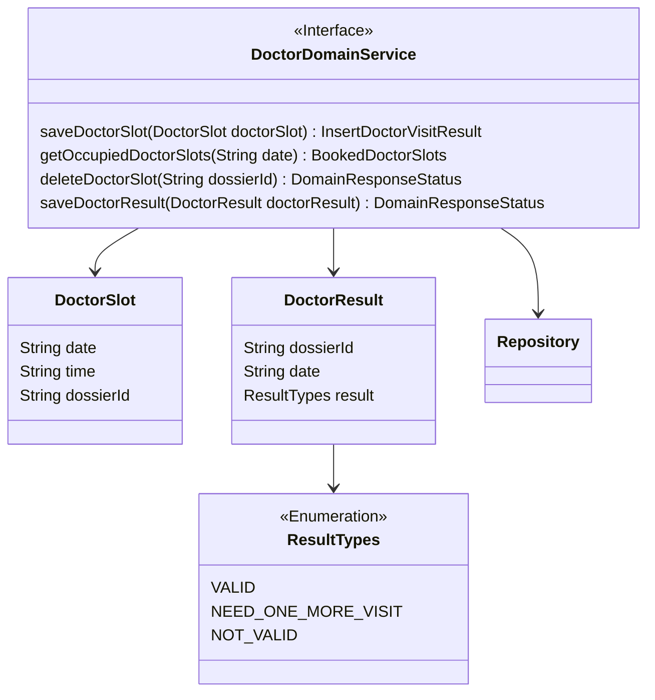
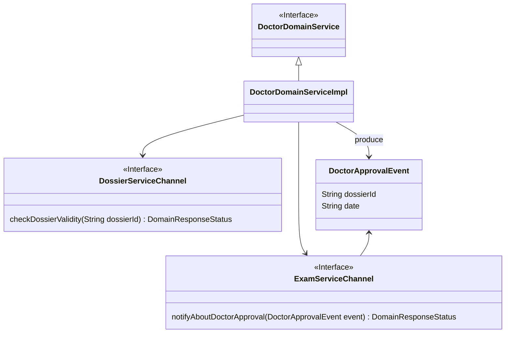
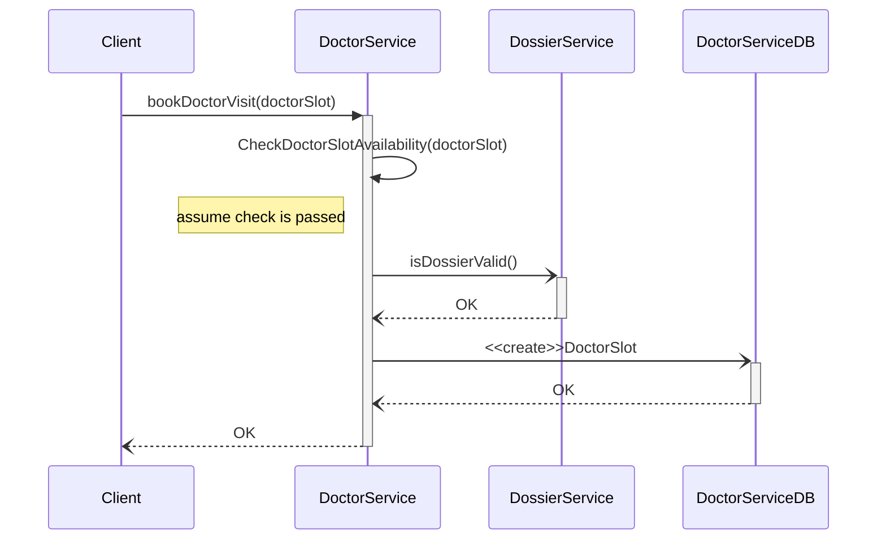

# DoctorService tactical design

- **Entities**: DoctorSlot
- **Value objects**: DoctorResutl
- **Events**: DoctorApprovalEvent


## Doctor domain service


<div id="class_context" align="center">[Fig 1] Diagramma della struttura del Doctor bounded contex</div>


## Doctor bounded context communicaiton


<div id="class_communication" align="center">[Fig 2] Diagramma che mostra come Doctor bounded context comunica con DossierContext e </div>

## Sequence diagramm



<div id="sequence_dossier" align="center">[Fig 3] Diagramma di sequenza che mostra un scenario di successo della prenotazione di una visita dal dotore</div>


### Registrazione dei risultati 
```mermaid
sequenceDiagram


```