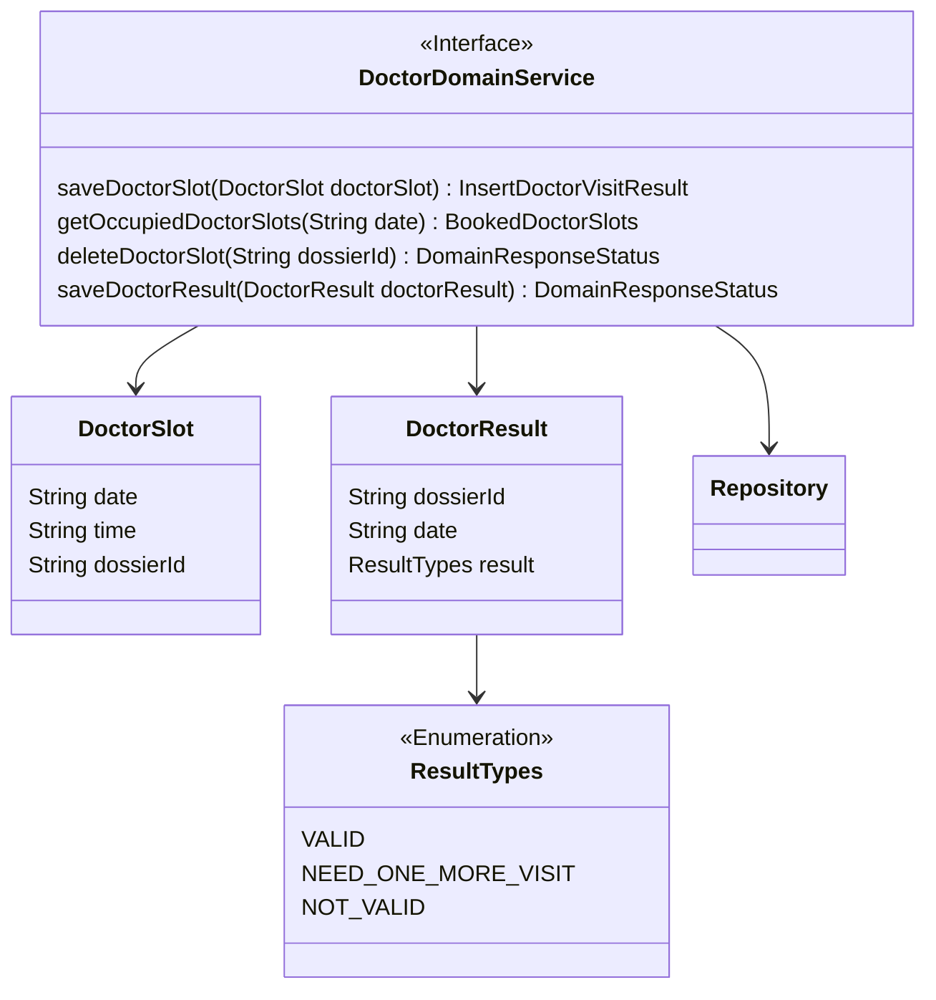
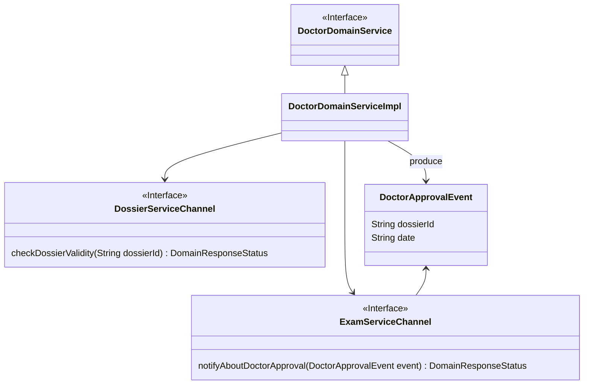
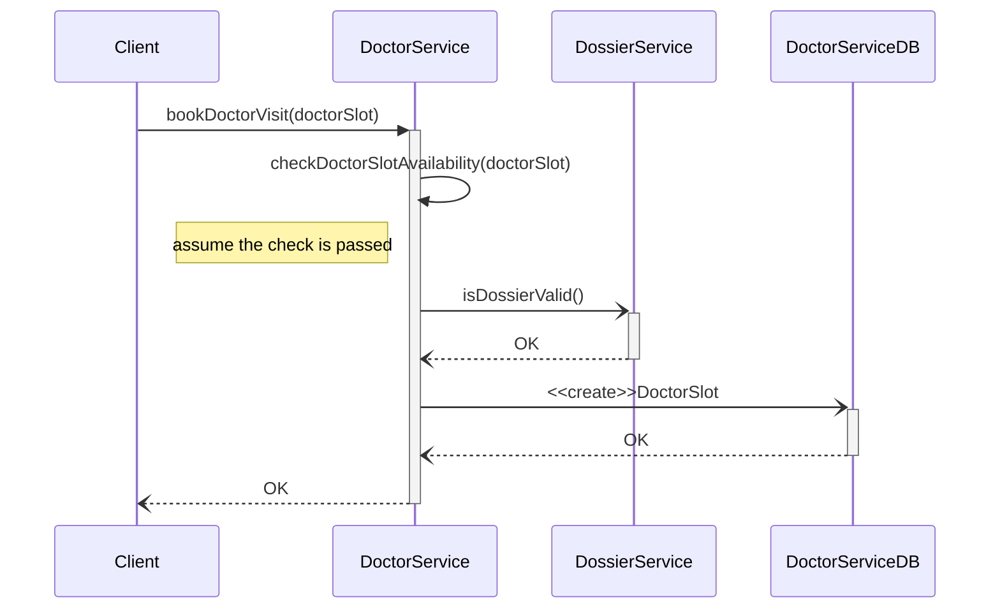
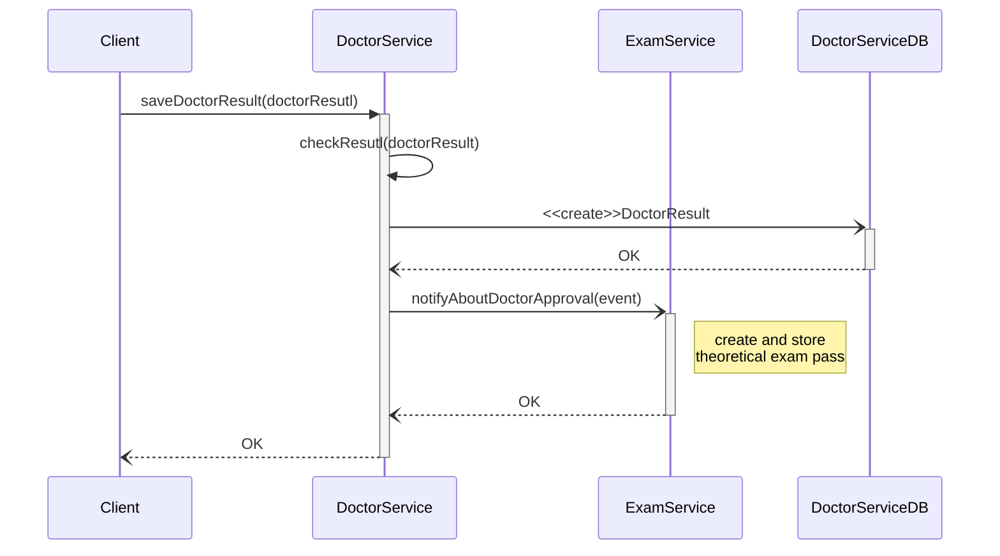

# DoctorService tactical design

- **Entities**: DoctorSlot
- **Value objects**: DoctorResult
- **Events**: DoctorApprovalEvent
  
<!-- <a href="#domain">figura</a> -->

## Doctor domain service

Il dominio in esame, si occupa della gestione di tutto ciò che concerne il subdomain relativo alle attività del Doctor, all'interno della scuola guida. Le funzionalità gestite dal servizio, riguardano in particolar modo la gestione dei _Doctor Slot_.

Ciascun Doctor Slot, rappresenta la visita con il dottore per un Iscritto, in un determinato giorno e in una determinata data, concordata con il Segretario al momento della prenotazione. Ulteriori constraints relativi alle visite, riguardano:
- la possibilità di prenotare una visita solo nelle date proposte;
- la durata massima prefissata, di ciascuna visita, pari a quindici minuti.

I metodi che il microservizio mette quindi a disposizione, riguardando nel dettaglio le seguenti funzionalità:
- inserimento di un nuovo doctor slot;
- richiesta dei doctor slot occupati in una certa data;
- eliminazione di un doctor slot;
- salvataggio del risultato di una visita, per un certo iscritto.
Le informazioni manipolate dal servizio, sono tutte inserite e storicizzate nel db, dai doctor slot ai doctor results.

All'interno del domain service in questione, il Doctor Slot è stato identificato come _Entity_, in quanto è distinguibile da altri doctor slots, mediante l'Id della pratica dell'iscritto a cui la visita fa riferimento.
Mentre _Doctor Results_, rappresenta un Value Object, quindi riutilizzabile su più oggetti, e non strettamente o direttamente identificabile, se non mediante l'id del dossier. Però, possono essere presenti sul Db più doctor results relativamente a un singolo DossierId, relativi a molteplici visite effettuate.

[Fig 1] Diagramma della struttura del Doctor bounded context

## Doctor bounded context communication

Per completare, alcune delle attività di cui sopra, è stato necessario inserire la comunicazione di questo servizio, con altri servizi esterni. Ad esempio per verificare la validità di un dossier o notificare il termine di una visita a Exam Service.

In particolar modo, la comunicazione con Exam Service è necessaria per poter permettere all'iscritto di conseguire l'esame teorico ed eventualmente successivamente l'esame pratico.

La comunicazione avviene mediante un evento: _Doctor Approval Event_, che rappresenta il termine (con successo) della visita di un iscritto, che può quindi procedere nel suo percorso di formazione all'interno della scuola guida.

[Fig 2] Diagramma che mostra come Doctor bounded context comunica con DossierContext e 

## Sequence diagrams

Di seguito alcuni diagrammi di sequenza che descrivono le principali operazioni, che il servizio in esame offre e implementa.

Il primo mostra la sequenza di azioni necessarie per prenotare la visita dal dottore per un certo iscritto. Nel caso in cui l'assunzione inserita non sia verificata, verrà ritornato all'utente un messaggio di errore indicando che la data e l'orario desiderati non sono disponibili. Un ulteriore controllo avviene al passaggio successivo, in cui si verifica che il dossier Id fornito per la prenotazione esista e sia valido. Anche in questo caso, se il check non restituisce un feedback positivo, viene restituito all'utente un differente messaggio d'errore.

[Fig 3] Diagramma di sequenza che mostra un scenario di successo della prenotazione di una visita dal dottore

### Registrazione dei risultati 

Il diagramma di sequenza in figura, mostra la sequenza di azioni eseguite dopo la registrazione del risultato positivo di una visita, per un certo iscritto.
La prima verifica effettuata, riguarda il check sul risultato della visita (deve essere VALID per poter proseguire).
Se viene restituito risultato positivo si procede con il salvataggio del Doctor Result corrispondente sul db.
Successivamente si procede alla notifica della visita mediante l'evento _Doctor Approval Event_, a Exam Service, che procede alla creazione del Theoretical exam Pass, un registro che tiene il conto dei tentativi d'esame teorico effettuati.

[Fig 4] Diagramma di sequenza dove dopo registrazione di un risultato positivo della visita dal dottore viene avviata la creazione di registro esame teorico 
