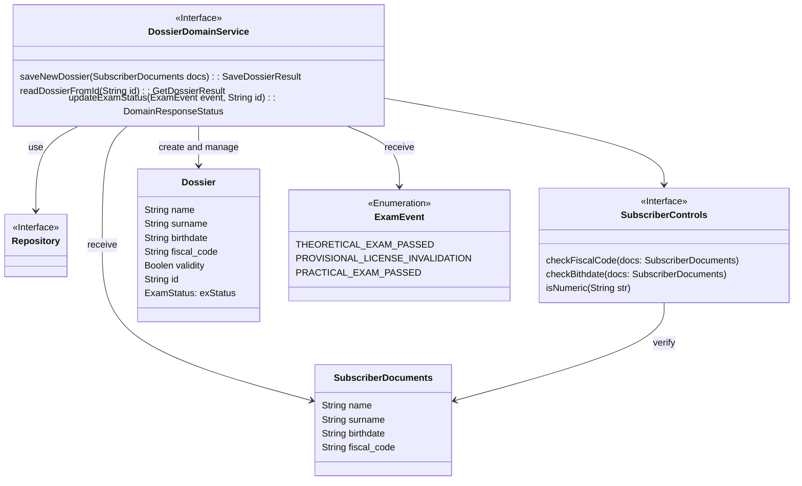
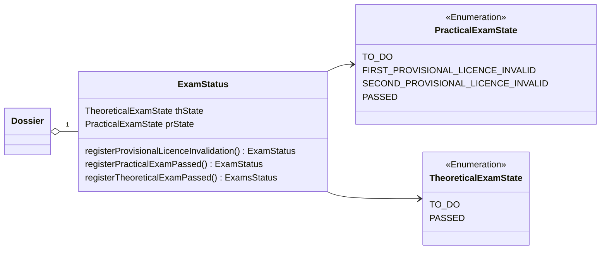

# DossierService tactical design

- **Entities**: Dossier
- **Value objects**:  ExamStatus, SubscriberDocuments
- **Events**: ExamEvent
- **Specifications**: SubscriberControls

## Dossier domain service
**DossierService** nel suo *Model* contiene il domain service *DossierDomainService* che ha i compiti: 
- Registrare le nuove pratiche degli iscritti e verificare che i dati forniti dal client sono conformi con il modello del dominio.
- Fornire le pratiche in caso delle richiese
- Reagire all'*ExamEvent* gestendo la logica di aggiornamento del macro stato degli esami (*ExamSatatus") che include invalidazione della pratica in caso se il secondo foglio rossa era invalidato.

Il modello dominio ha una singola entità *Dossier* che contiene l'informazione della pratica. Per crearla il client deve inviare un value object *SubscriberDocuments* che viene validato tramite le specifiche *SubscriberControls*

[Fig 1] Diagramma del modello di dominio di DossierService

## Dossier

Ogni *Dossier* contiene un value object *ExamStatus* che contiene due campi:
- *theoreticalExamState* che mostra se iscritto ha pasatto l'esame teorico.
- *practicalExamState* che mostra se iscritto ha passato l'esame teorico e se ha gìà avuto invalidazioni del foglio rossa. Questo campo non contine il numero di fallimenti per ogni singolo foglio rossa, lasciando questa responsabilità a *ProvisionalLicenseHolder* del ExamContext

*ExamStatus* incapsula un insieme di invarianti che impediscono la creazione degli stati inconsisteni nel modello del dominio (esempio: l'esame pratico è passato mentre l'esame teorico non è passato).

[Fig 2] Diagramma che descrive la classe ExamStatus che appartiene alla classe Dossier 
