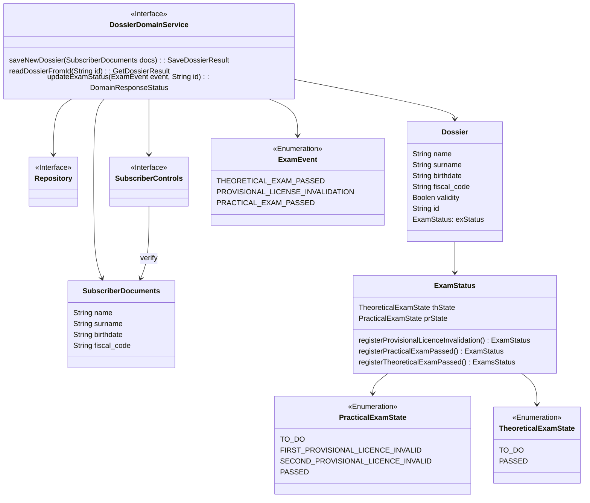

# Dossier Service tactical design

- **Entities**: Dossier
- **Value objects**:  ExamsStatus, SubscriberDocuments
- **Events**: ExamEvent

```mermaid
classDiagram


class DossierDomainService {
    <<Interface>>
    saveNewDossier(SubscriberDocuments docs): SaveDossierResult
    readDossierFromId(String id): GetDossierResult
    updateExamStatus(ExamEvent event, String id): DomainResponseStatus
}

class Repository 
<<Interface>> Repository 

class SubscriberControls 
<<Interface>> SubscriberControls 

DossierDomainService --> Repository
DossierDomainService --> Dossier
DossierDomainService --> ExamEvent
DossierDomainService --> SubscriberDocuments
DossierDomainService --> SubscriberControls 

SubscriberControls --> SubscriberDocuments : verify

class SubscriberDocuments{
    String name
    String surname
    String birthdate
    String fiscal_code

}

class Dossier{
    String name
    String surname
    String birthdate
    String fiscal_code
    Boolen validity
    String id
    ExamStatus: exStatus
}
class ExamEvent{
    <<Enumeration>>
    THEORETICAL_EXAM_PASSED
    PROVISIONAL_LICENSE_INVALIDATION
    PRACTICAL_EXAM_PASSED
}


Dossier --> ExamStatus
class ExamStatus{
    TheoreticalExamState  thState
    PracticalExamState  prState
    registerProvisionalLicenceInvalidation() ExamStatus
    registerPracticalExamPassed() ExamStatus
    registerTheoreticalExamPassed() ExamsStatus
}

ExamStatus --> PracticalExamState
ExamStatus --> TheoreticalExamState


class PracticalExamState {
    <<Enumeration>>
    TO_DO
    FIRST_PROVISIONAL_LICENCE_INVALID
    SECOND_PROVISIONAL_LICENCE_INVALID
    PASSED
}


class TheoreticalExamState {
    <<Enumeration>>
    TO_DO
    PASSED
}

```