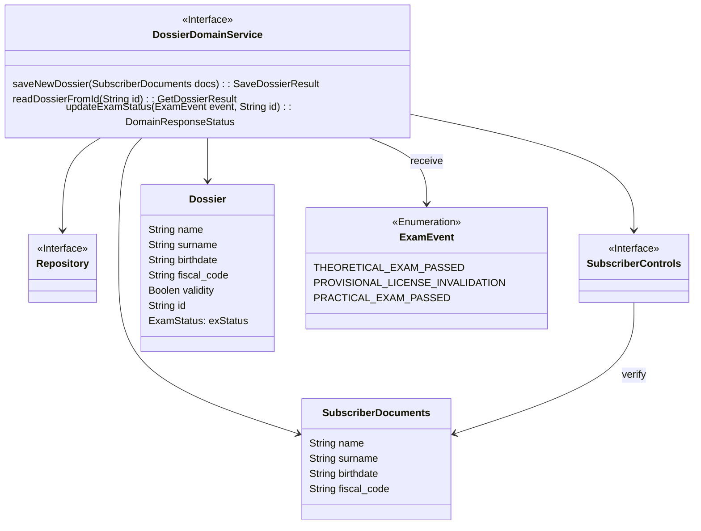

# DossierService tactical design

- **Entities**: Dossier
- **Value objects**:  ExamsStatus, SubscriberDocuments
- **Events**: ExamEvent

## Dossier domain service

[Fig 1] Diagramma dell'organizzazione del Dossier bounded context

## Dossier

[Fig 2] Diagramma che descrive la classe ExamStatus che appartiene alla classe Dossier 
