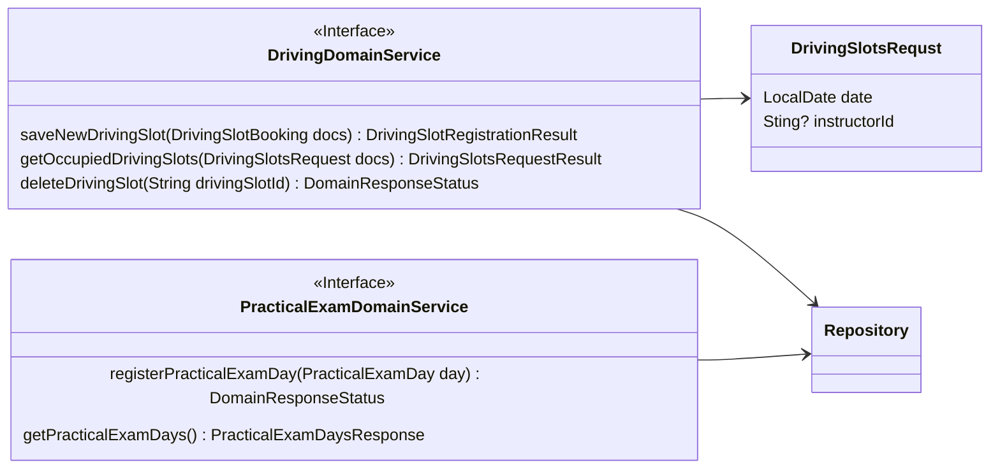
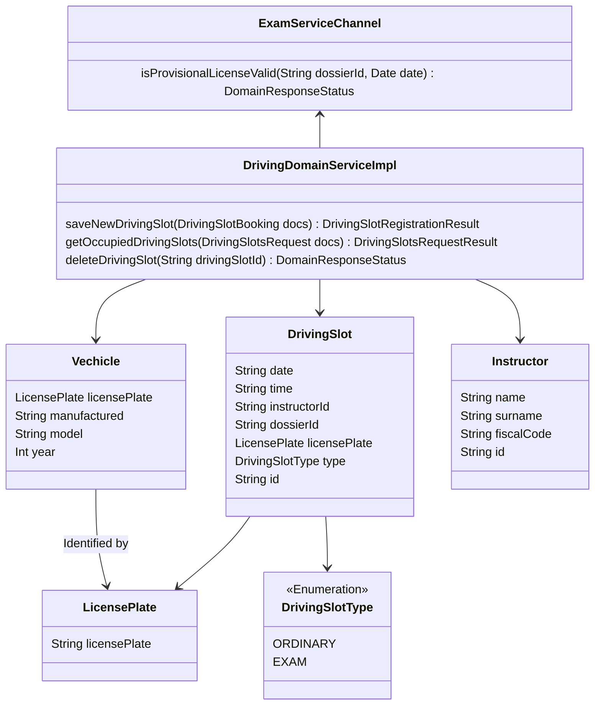

# DrivingService tactical design
- **Entities**: DrivingSlot, Instructor, Vechicle
- **Value objects**: DrivingSlotBooking, DrivingSlotsRequst, LicensePlate, PracticalExamDay

## Domain services of driving bounded context

### Uno

## Sequence diagramm
