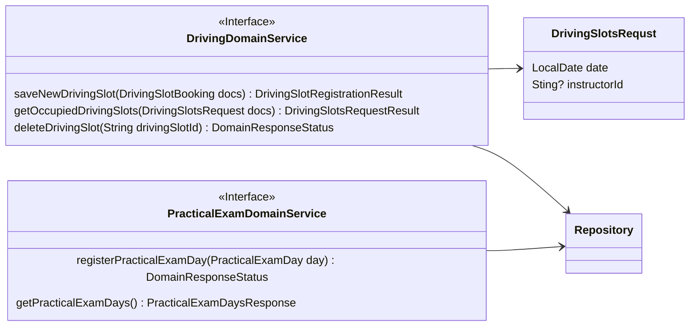
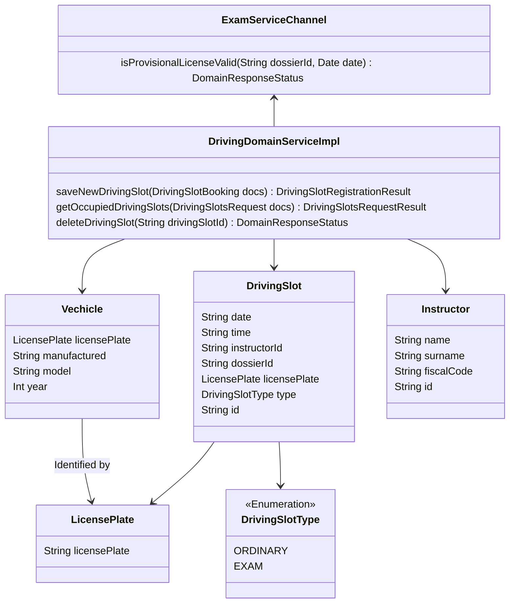
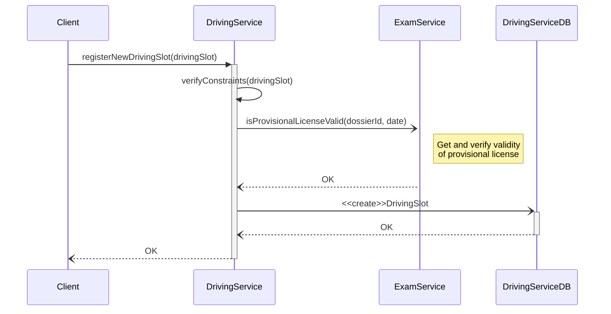

# DrivingService tactical design
- **Entities**: DrivingSlot, Instructor, Vehicle
- **Value objects**: DrivingSlotBooking, DrivingSlotsRequest, LicensePlate, PracticalExamDay

## Domain services of driving bounded context

Il dominio in esame, si occupa della gestione di tutto ciò che concerne il subdomain relativo alle attività principali di una scuola guida, le guide pratiche con iscritti e istruttori.

In particolar modo, ciascuna guida pratica è identificata come Driving Slot, e richiede per la relativa prenotazione una data ed eventualmente un istruttore "preferito", da ricercare e inserire nella prenotazione.
Ciascun Driving Slot, dispone inoltre di diversi constraints relativi al dominio. Quali ad esempio:
- possibilità di prenotarne solo uno per ciascun iscritto;
- durata prefissata di 30 minuti;
- duplice tipologia: esame pratico o guida pratica;

Nel caso in cui il driving slot, rappresenti un esame pratico, si aggiungono ulteriori limitazioni necessarie per rispettare il dominio che il progetto va a supportare, ad esempio saranno necessari dodici driving slot pregressi per un iscritto che voglia procedere con un esame pratico.

Più in particolare, il microservizio Driving, offre i seguenti metodi per manipolare i driving slots:
- salvataggio di un nuovo driving slot;
- richiesta dei driving slot attualmente occupati in una certa data ed eventualmente per un certo istruttore;
- eliminazione di un driving slot prenotato;

Come accennato precedentemente, un driving slot può anche riferirsi a un esame pratico. Per questo motivo si è deciso d'inserire nel servizio in esame, alcuni metodi aggiuntivi per la registrazione e la ricerca dei giorni in cui sarà quindi possibile inserire determinate guide d'esame.

Approfondendo ulteriormente, si procede con una breve spiegazione delle scelte effettuate per la rappresentazione e categorizzazione degli elementi di questo servizio:
- License Plate, identifica esattamente un veicolo ed è stato quindi rappresentato come _Value Object_. Mentre un veicolo, univocamente accessibile mediante license plate, viene identificato come _Entity_;
- Instructor, univocamente identificabile mediante l'id, quindi identificato come _Entity_;
- Driving Slot, univocamente identificabile mediante l'id a lui assegnato, identificato come _Entity_;
- Practical exam Day, rappresenta un giorno in cui guide d'esame sono inseribili. Non è direttamente identificabile, perciò viene categorizzato come _Value Object_;
- Driving Slots Booking e Driving Slots request, sono documenti inviati dall'utente durante le fasi di prenotazione di un nuovo driving slot, identificati anch'essi come _Value Objects_.

[Fig 1] Diagramma di domain services del Driving bounded context

### Bounded Context Communication

Per consentire l'implementazione di alcune delle funzionalità accennate sopra, è stato necessario inserire un meccanismo che consentisse a Driving Service, la comunicazione con Exam Service: Exam Service Channel.

Quest'ultimo fornisce una connessione mediante Web Client al servizio Exam, necessaria per verificare la validità (in una data fornita) del foglio rosa univocamente collegato a un dossier id.

Il foglio rosa è infatti un prerequisito necessario per procedere alla prenotazione di qualsiasi tipologia di Driving Slot. Viene caratterizzato da una validità e da un numero di tentativi d'esame effettuabili prefissato in base a quelle che sono le regole del dominio.

[Fig 2] Diagramma della struttura del Driving bounded context

## Sequence diagrams

Il diagramma di sequenza in figura, consente di descrivere nel dettaglio la procedura necessaria alla registrazione di una nuova Guida Pratica, che non rappresenta perciò un esame pratico.
La prima operazione effettuata successivamente alla richiesta di prenotazione, è la verifica dei requisiti necessari, quali ad esempio la validità degli orari/giorni forniti, dei dati forniti per l'istruttore.
Se questo viene validato, si procede con il controllo del foglio rosa. Questa verifica avviene mediante Exam Service, verso il quale otteniamo collegamento mediante Exam Service Channel, precedentemente introdotto.
Se anche la seconda verifica, si procede con successo all'inserimento del Driving Slot nel DB.

Ipotizzando la prenotazione di una guida d'esame, si aggiungerebbero alcuni constraints e conseguentemente ulteriori verifiche da completare con successo(ad esempio sulla corretta selezione di un giorno d'esame), prima di poter inserire il driving slot sul database.

[Fig 3] Diagramma di sequenza dell'operazione di registrazione di una nuova guida pratica
