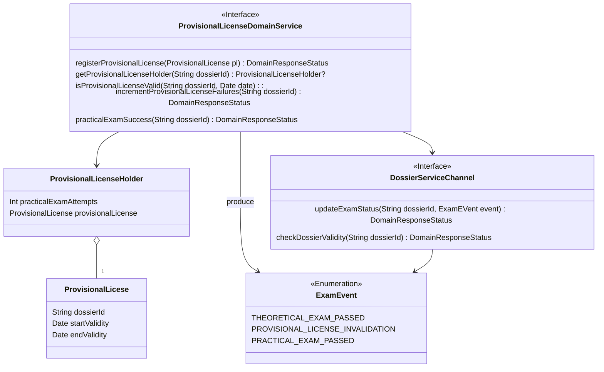
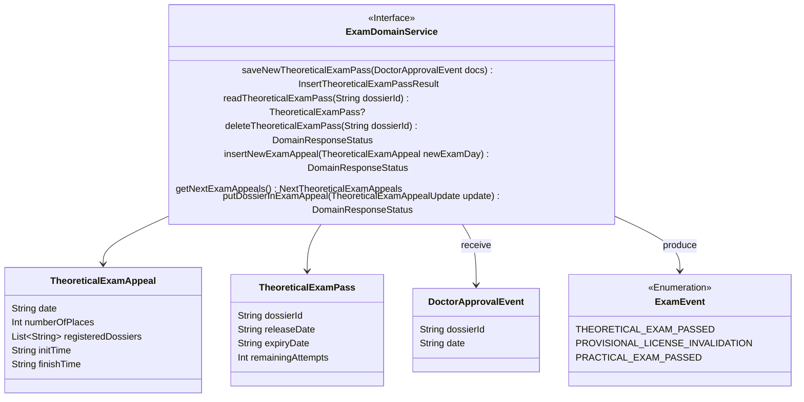
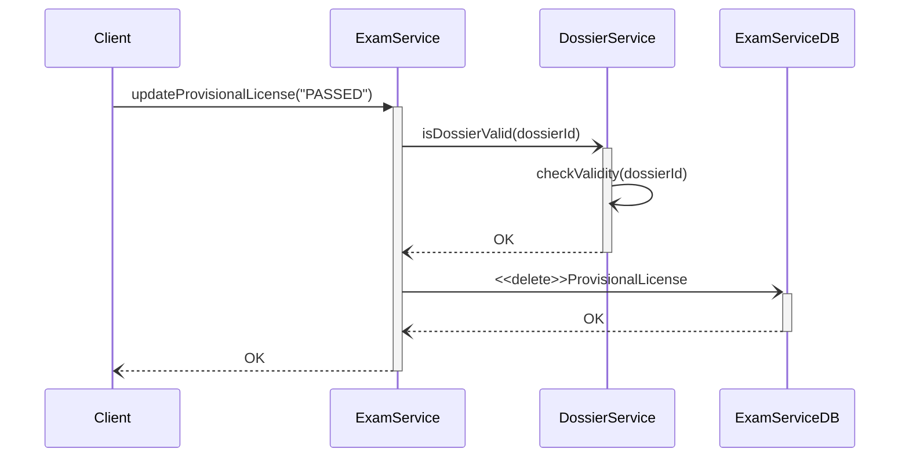

# ExamService tactical design
- **Entities**: TheoreticalExamAppeal, TheoreticalExamPass, ProvisionalLicense
- **Value objects**: ProvisionalLicenseHolder, TheoreticalExamAppealUpdate
- **Events**: DoctorApprovalEvent, ExamEvent

## Provisional license domain service

[Fig 1] Diagramma di domain service che gestisce le operazioni che riguardano il foglio rossa 

## Theoretical exam domain service

[Fig 2] Diagramma di domain service che copre gli aspetti che riguardano l'esame teorico

## Sequence diagram

[Fig 3] Diagramma di sequenza che descrive l'operazione di registrazione del risultato positivo del esame pratico
