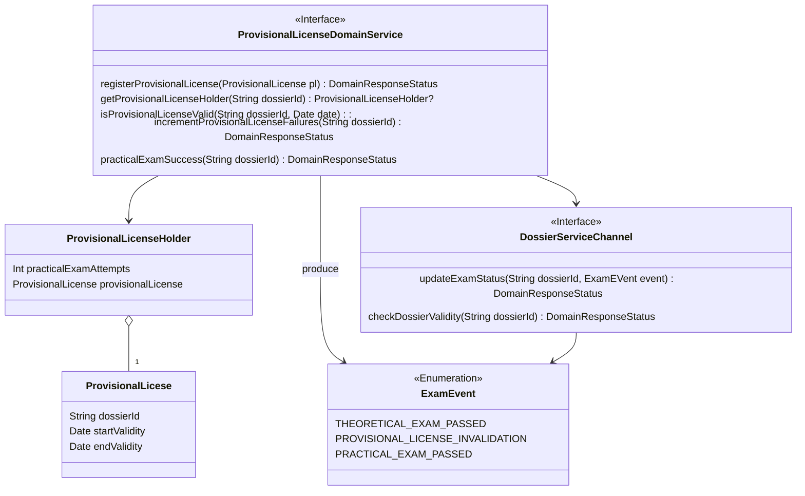
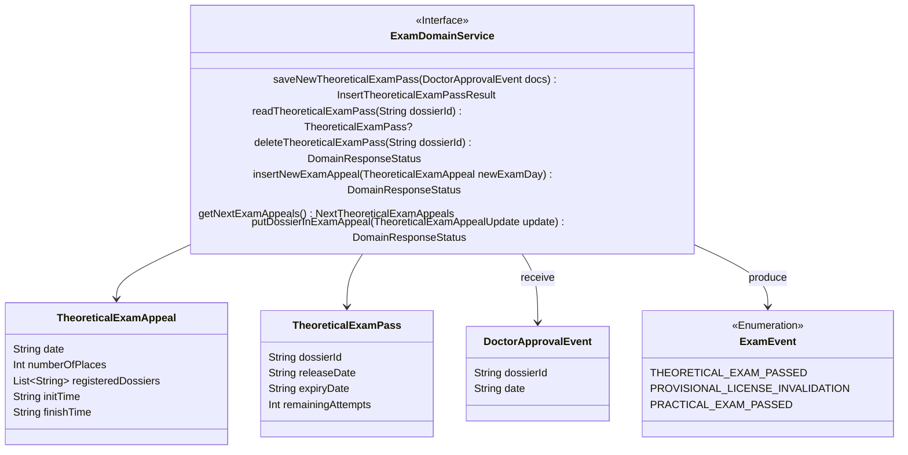
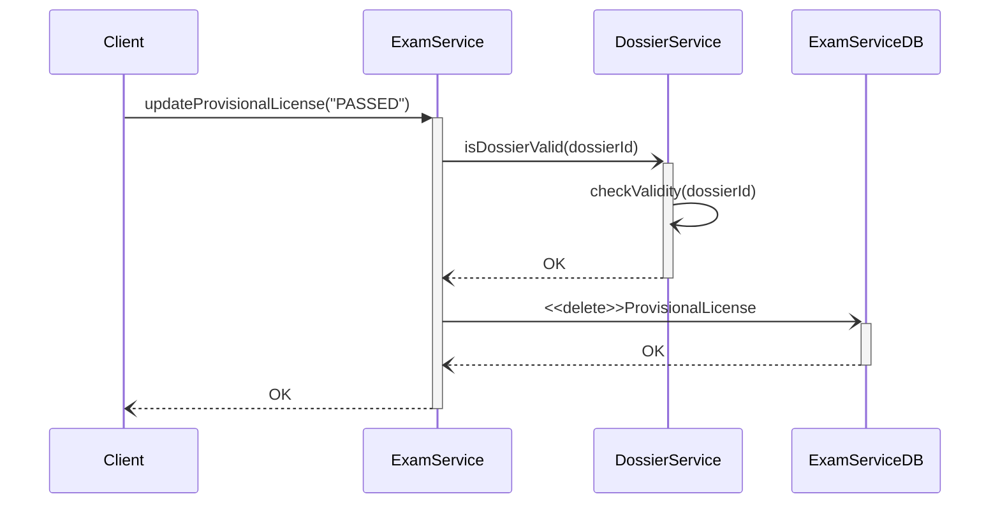

# ExamService tactical design
- **Entities**: TheoreticalExamAppeal, TheoreticalExamPass, ProvisionalLicense
- **Value objects**: ProvisionalLicenseHolder, TheoreticalExamAppealUpdate
- **Events**: DoctorApprovalEvent, ExamEvent

## Provisional license domain service

Exam Service ricopre alcune delle parti fondamentali del dominio che il progetto vuole andare a supportare, in particolare: la gestione degli esami teorici e del foglio rosa.
La gestione del foglio rosa (aka Provisional License), viene astratta dall'oggetto Provisional License Holder. Quest'ultimo funge infatti da "incapsulatore" per un singolo foglio rosa.

Un oggetto di questo tipo si è reso necessario, dati i constraints relativi a esso che il dominio e il committente ci impongono di rispettare. Tra cui:
- Numero massimo di tentativi d'esame pratico pari a tre;
- Entro un termine di dodici mesi di validità.
Questo implica che preventivamente all'iscrizione a un tentativo d'esame pratico, verifichiamo la validità del foglio rosa e successivamente aggiorniamo il Provisional License Holder, tenendo conto del tentativo effettuato.
    
Per fornire le funzionalità di cui sopra, sono inseriti i seguenti metodi per:
- la registrazione di una nuova Provisional License;
- la richiesta di un particolare Provisional License Holder, univocamente identificato dal Dossier Id a cui il relativo foglio rosa è univocamente associato;
- un check sulla validità della Provisional License di un Iscritto, in un dato momento;
- la gestione dei tentativi d'esame pratico;
- la registrazione e aggiornamento dello stato d'esame: quest'ultimo avviene mediante l'evento _Exam Event_, con il quale comunichiamo a Dossier Service (mediante Dossier Service Channel), il passaggio dell'esame pratico.

Dossier Service Channel, introdotto precedentemente, fornisce una connessione mediante VertX WebClient al service Dossier, mediante la quale effettuare le operazioni di cui sopra.

Provisional License Holder, viene identificato come Value Object, in quanto non identificabile univocamente ma solo tramite Provisional License in esso contenuto, a sua volta categorizzato come Entity.
Provisional License è infatti univoco all'interno del sistema, e univocamente associato a un dossierId.

[Fig 1] Diagramma di domain service che gestisce le operazioni che riguardano il foglio rossa 

## Theoretical exam domain service

Ciascun esame teorico, richiede alcuni constraints:
- un theoretical exam pass valido
- la scelta di un appello a cui iscriversi tra quelli disponibili

Un theoretical exam pass, rappresenta un registro d'esame teorico, utilizzato come modello astratto per semplificare la gestione dei tentativi d'esame entro il termine prefissato di validità della visita con il dottore. Il pass viene infatti consegnato solo successivamente alla visita con il dottore, con risultato positivo.

Il Servizio in esame, successivamente alla ricezione di un _Doctor Approval Event_, crea un Theoretical Exam Pass per il dossier Id fornito mediante il messaggio, inizializzato a default. Successivamente il servizio, fornisce alcuni _Exam Event_, per monitorare e aggiornare Dossier Service, in merito allo stato d'esame di un Iscritto. In particolare le tipologie di evento disponibili, sono le seguenti:
- Provisional License Invalidation, con cui segnalare il raggiungimento del limite di tentativi d'esame pratico o della validità temporale del foglio rosa;
- Theoretical Exam Passed o Practical Exam Passed, con cui segnalare il conseguimento del rispettivo esame;
Lo stato d'esame viene quindi mantenuto e aggiornato all'interno di Dossier Service.

Per fornire le funzionalità di cui sopra, sono forniti i seguenti metodi:
- per la gestione degli appelli d'esame teorico (inserimento, richiesta, aggiornamento). L'aggiornamento si rende necessario dal fatto che ciascun Dossier Id, deve essere inserito nella coda dell'appello d'esame a cui viene iscritto.
- per la creazione, lettura e cancellazione in un Theoretical Exam Pass.

Ciascun Theoretical Exam Pass è direttamente e univocamente identificabile dal DossierId a cui viene assegnato, quindi identificato come entità all'interno dell'analisi del dominio. Ugualmente, ogni appello d'esame teorico è univoco nella data in cui viene inserito, e perciò identificato anch'esso come entità.
Mentre ciascun oggetto di tipo Theoretical Exam Appeal Update, utilizzato per l'aggiornamento della lista d'iscritti a uno specifico appello d'esame teorico, non è identificabile univocamente e perciò identificato come Value Objects, all'interno del dominio in esame.

[Fig 2] Diagramma di domain service che copre gli aspetti che riguardano l'esame teorico

## Sequence diagram

Il diagramma di sequenza in figura, mostra le azioni effettuate per l'operazione di registrazione del conseguimento dell'esame pratico (da parte di un Iscritto).
Come visibile dal diagramma dopo il conseguimento dell'esame, la Provisional License relativa all'iscritto viene eliminata e rimossa dal sistema.

Per ciascuna operazione l'iter iniziale è il medesimo: aggiornamento della Provisional License, e successivamente check del dossier relativo ed esecuzione di ulteriori azioni se necessarie.
Una sequenza simile viene inoltre seguita per la gestione del Theoretical Exam Pass, con riferimento però all'esame teorico, all'interno del dominio in esame.

[Fig 3] Diagramma di sequenza che descrive l'operazione di registrazione del risultato positivo del esame pratico
