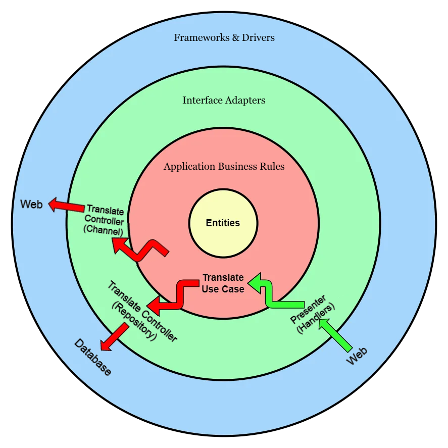
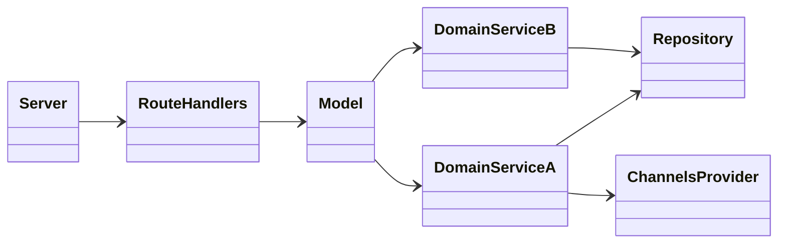
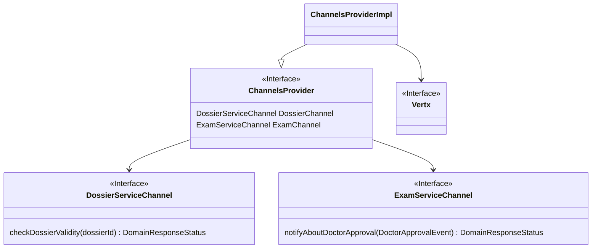

# Tactical design
L'architettura dei microservizi è stata progettata seguendo i principi di *[Clean Architecture](https://betterprogramming.pub/the-clean-architecture-beginners-guide-e4b7058c1165)* che permettono scrivere applicazioni Loosely-Coupled ovvero con forte disaccoppiamento dell’applicazione dall’infrastruttura.

In particolare sono stati individuati quattro layer: 
- **Frameworks & Drivers** layer: Implementa il punto di ingresso utilizzato dai client del servizio per effettuare delle richieste utilizzando API REST esposte da ciascun microservizio, pertanto questo livello definisce gli endpoint REST supportati dal servizio insieme alla relativa interfaccia. 
- **Interface Adapters** layer: Questo livello è composta da due tipi di componenti principali: gli adattatori di input e gli adattatori di output.
  - *Gli adattatori di input* sono responsabili della gestione della comunicazione proveniente dal mondo esterno, come le interfacce utente o i punti di accesso delle API, e della conversione di tale input in un formato comprensibile per la logica di business dell'applicazione. Essi ricevono l'input dell'utente e lo traducono in una forma che può essere elaborata dall'applicazione
  - *Gli adattatori di output* gestiscono la comunicazione dall'applicazione verso il mondo esterno. Sono responsabili di convertire le richieste del modello di business in un formato  riconoscibile dal Frameworks & Drivers layer. Gli adattatori di output interagiscono con database e servizi esterni.
- **Application** layer o (Application Business Rules): Contiene una raccolta di tutti i casi d’uso del servizio in questione e le relative azioni per ciascuno di essi.
- **Domain** layer o (Enterprice Business Rules): : Rappresenta il livello centrale di ogni servizio in cui sono definite le regole di business del contesto. Contiene la definizione di eventi, entity, value objects.

[Fig 1] Illiustrazione del Clean Architecture nel contesto dei microservizi realizzati  

Per la realizzazione dei microservizi, sono state seguite le linee guida del [tactical design](https://thedomaindrivendesign.io/what-is-tactical-design/), cercando quindi di individuare tra i concetti del dominio quali avessero il ruolo di entità, evento, value objects o domain service

## Design dei microservizi

Il diagramma sul <a href="#class_architecture">[Fig 2]</a> descrive le relazioni tra diverse componenti dell'architettura:

- ***Server***: responsabile per l'interazione con i client o altri sistemi esterni. Il server riceve le richieste in arrivo, tramite le API REST, e le inoltra al gestore delle rotte (*RouteHandlers*).

- ***RouteHandlers***: questa componente si occupa di gestire le richieste ricevute dal server e di indirizzarle ai metodi del modello appropriati. 

- ***Model***: questa componente contiene *Domain Services* che rappresentano la logica del modello di business.

- ***DomainService***: ogni servizio del dominio rappresentano una parte della logica del business del bounded context. Inoltre, i servizi del dominio possono dipendere da:
  - ***Repository***: questa componente rappresenta un'astrazione per l'accesso ai dati persistenti.
  - ***ChannelsProvider***: questa componente permette ottenere cannali di comunicazione con altri microservizi. (Vedi avanti: <a href="#class_channels">[Fig 3]</a>)
  

[Fig 2] Diagramma che mostra la struttura generale dei microservizi 

### ChannelsProvider e tipi di risposte
***ChannelsProvider*** è una factory che produce e fornisce l'accesso gli adattatori di output che permettono comunicare con gli altri micro servizi. Ogni chanel è rappresentato da una interfaccia che fornisce i metodi coerenti con il modello di business completamente nascondendo l'aspetto tecnologico necessario per la comunicazione. 

Un esempio di ChannelsProvider si può vedere sul <a href="#class_channels">[Fig 3]</a>. Sulla figura si può anche notare che i metodi dei cannali resituiscono una enumerazione *DomainResponseStatus* che permette comprendere le risposte di un altro dominio (es. DOSSIER_INVALID, VALID_DOSSIER_ALREADY_EXISTS ecc.) o trasformare i problemi tecnologici (es. errori di comunicazione) in formato comprensibile dal dominio (es. DELETE_ERROR, UPDATE_ERROR).
Stesso approccio viene utilizzato anche per la *Repository* che tipicamente resituisce *RepositoryResponseStatus* che successivamente viene convertito in *DomainResponseStatus* tramite una mappa di conversione.
*RouteHandler* a sua volta ha una tabella per convertire le risposte del domino nei codici HTTP. 

[Fig 3] Diagramma che mostra un esempio come microservizi comunicano tra loro. In particolare sono mostrati i canali di comunicazione disponibili per DoctorService 

## Organizzazione dei artifatti
I microservizi sono composti da 4 package principali:
- *channels* contiene gli artefatti responsabili per la comunicazione con altri microservizi
- *database* package contenente gli artefatti che permettono accedere al database tramite Repository pattern
- *handlers* raggruppa gli artefatti che gestiscono le rotte delle API REST
- *model* contiene gli artefatti del modello del dominio

[Fig 4] Diagramma dei package comune per tutti microservizi

## Architettura generale
Secondo l'architettura generale :
- il client comunica con uno o più microservizi tramite le API REST. 
- Alcuni microservizi comunicano con altri microservizi tramite le API REST
- Ogni microservizio ha il suo proprio database

[Fig 5] Diagramma del deployment che visualizza un esempio dell'architettura generale dei nodi del sistema
