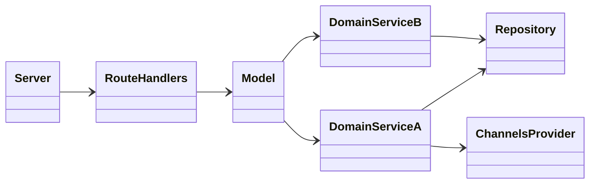
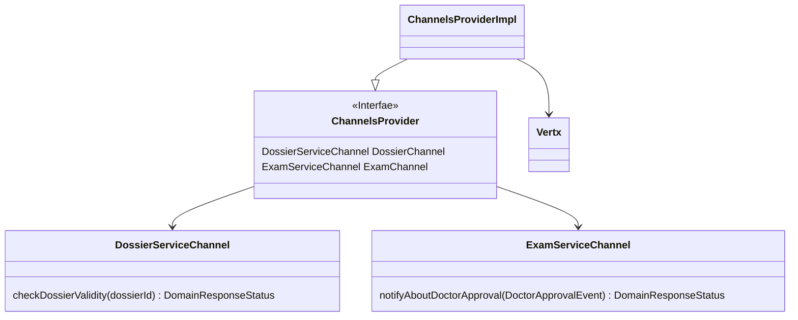

[Fig 1] Diagramma che mostra la struttura generale dei microservizi 

## ChannelsProvider

[Fig 2] Diagramma che mostra un esempio come microservizi comunicano tra loro. In particolare sono mostrete i cannali di communicazione disponibili per DoctorService 
