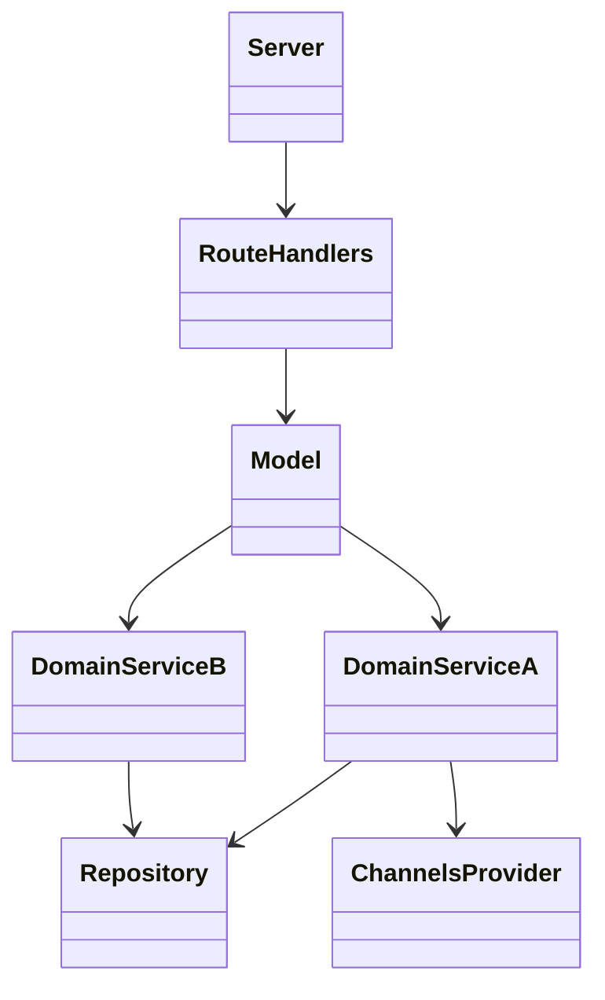
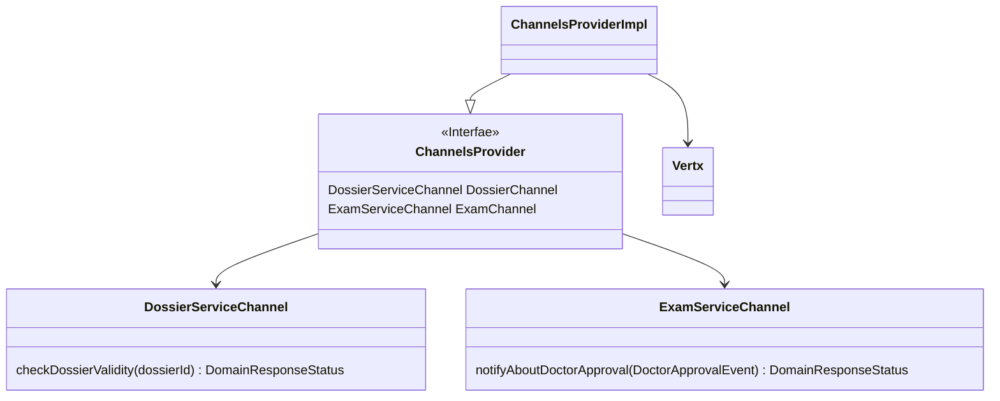

```mermaid
classDiagram
Server --> RouteHandlers
RouteHandlers --> Model
Model --> DomainServiceA
Model --> DomainServiceB
DomainServiceA --> Repository
DomainServiceA --> ChannelsProvider
DomainServiceB --> Repository

```

## ChannelsProvider

```mermaid
classDiagram

class ChannelsProvider{
    <<Interfae>>
    DossierServiceChannel DossierChannel
    ExamServiceChannel ExamChannel

}

ChannelsProviderImpl --|> ChannelsProvider
ChannelsProviderImpl --> Vertx

class DossierServiceChannel{
    checkDossierValidity(dossierId) DomainResponseStatus
}

class ExamServiceChannel{
    notifyAboutDoctorApproval(DoctorApprovalEvent) DomainResponseStatus
}
ChannelsProvider --> DossierServiceChannel
ChannelsProvider --> ExamServiceChannel

```
